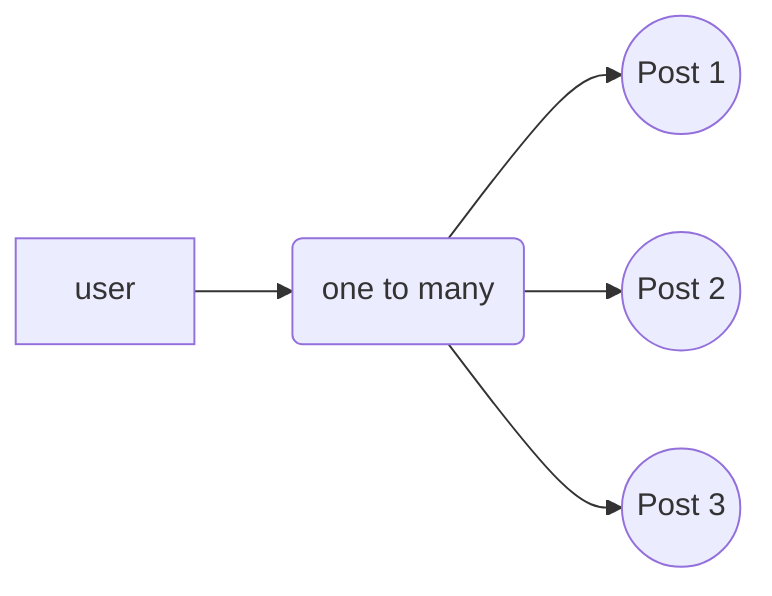
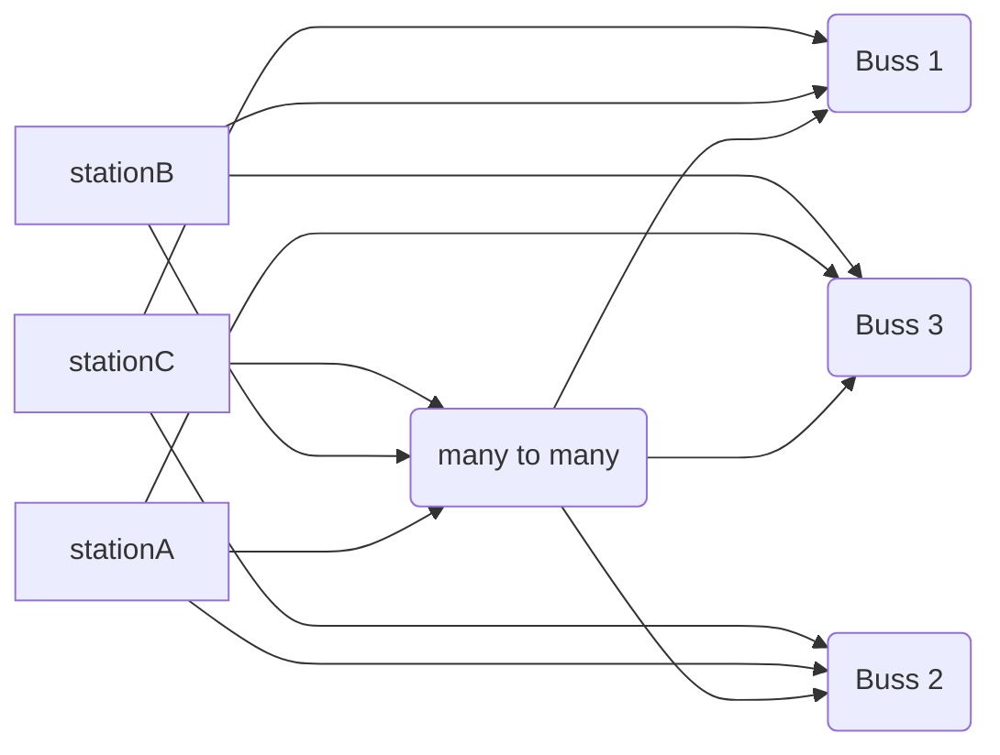

## MSquare Programming Fullstack Course

### Batch 2

### Episode-_20_ Summary

## Postgresql and Prisma

### What is Database?

- database ဆိုတာ data တွေ သိမ်းထားပေးတဲ့နေရာလို့ အကြမ်းအားဖြင့် သတ်မှတ်နိုင်ပါတယ်
- backend server မှာ server restart ဖြစ်လို့ ရှိရင် data တွေ ပျောက်သွားပြီးအသစ်က ပြန်စမှာ ဖြစ်ပေမယ့်
- database ထဲရှိ data တွေကတော့ delete မလုပ်ပစ်မချင်း အမြဲတမ်း သိမ်းထားပေးမှာဖြစ်ပါတယ်
- database မှာ အဓိကအားဖြင့် SQL database နဲ့ No SQL database ဆိုပြီး နှစ်မျိုးရှိပါတယ်


- ဒီနေ့ သင်ခန်းစာမှာတော့ SQL db(DataBase) အကြောင်း လေ့လာသွားကြပါမယ်
- Sql database ကို အသုံးပြုဖို့ အတွက် sql language နဲ့ ရေးသားပေးရပါတယ်
- sql command တစ်ခု ပြီးတိုင်း **`;`** နဲ့ ပိတ်ပေးရပါမယ်

##

### Connecting tables in sql database

- SQL database တွေဟာ relational database အမျိုးအစားတွေ ဖြစ်ကြပါတယ်
- SQL database ထဲရှိ table တွေဟာ တစ်ခုနဲ့ တစ်ခု ချိတ်ဆက်ပြီး အသုံးပြုလို့ ရပါတယ်

### why relation?

- SQL မှာ dataတွေကို table နဲ့ သိမ်းလေ့ရှိပါတယ်
- တကယ်လို့ data တွေကို table တစ်ခုထဲ စုပြီး သိမ်းထားမယ်ဆိုရင်
  - data တွေ ထပ်လာမျိုး ရှိလာပါမယ် ( data duplicate)
  - အဲ့ဒီ table ထဲက data တစ်ခုခုရှာမယ်ဆို သိမ်းထားတာ တွေ များနေတာမလို့ အချိန်ကြာပါမယ်။
  - မလိုအပ်ပဲ resource တွေ အများကြီး သုံးရပါမယ်
- ဒါကြောင့်မလို့ SQL မှာ table တွေ အများကြီး လုပ်ပြီး တစ်ခုနဲ့ တစ်ခု ချိတ်ဆက်ပြီး သုံးလေ့ရှိပါတယ်။

### _primary key_(PK) and _foreign key_(FK)

- table တစ်ခု ကို နောက် table တစ်ခုနဲ့ ချိတ်ဆက်သုံးတဲ့ အခါ _foreign key_ အနေနဲ့ ချိတ်ဆက်ပေးလေ့ရှိပါတယ်။

### နမူနာ


- parent table ကို child table နဲ့ ချိတ်ဆက်လိုတဲ့အခါ parent ရဲ့ id ( PK ) ကို child table ထဲမှာ ( FK ) အနေနဲ့ column တစ်ခု ထည့်ပြီး ချိတ်ဆက်ပေးရပါမယ်။

##

### Relationship in SQL

- SQL dbမှာ table တွေ ချိတ်ဆက်တဲ့ အခါ အများအားဖြင့် relation သုံးမျိုးဖြင့် ချိတ်ဆက် အသုံးပြုကြပါတယ်

### one to one relation

### one to many relation

### many to many relation

##

### one to one relation

- data တစ်ခု ကနေ တစ်ခု ဆီကိုပဲ ချိတ်ဆက်တာကို ဆိုလိုတာပါ။
- ဥပမာ ။ ။
  
  - country နဲ့ capital table နှစ်ခုရှိတယ်ဆိုပါစို့
  - အဲ့ဒီနိုင်ငံ အတွက် မြို့တော်ဟာ တစ်မြို့ပဲ ရှိတာမလို့ country id ( PK ) ကို capital မှာ FK အဖြစ် တစ်ခုပဲ ချိတ်ဆက်ထားရမှာကို ဆိုလိုတာပါ
  ##
  ### one to many relation
  - တစ်ခုကနေ အများကို ချိတ်ဆက်ပေးတာဖြစ်ပါတယ်။
  - ZOOM meeting တစ်ခုကို user အများ join ထားသလိုမျိုးပါ။
  - နောက် ဥပမာ တစ်ခုက Facebook မှာ user တစ်ယောက်က status post အများကြီး တင်ထားသလိုမျိုးပါ။



##

### many to many relation

- အများနဲ့ အများ ကိုချိတ်ဆက်တာဖြစ်ပါတယ်
-



- station A က bus 1 ,2,3 နဲ့ ချိတ်ဆက်ထားသလို
- bus 1 ကလည်း station A,B,C ကို ချိတ်ဆက်ထားပါတယ်
- ကျန်တဲ့ station တွေကလည်း bus အားလုံးနဲ့ ချိတ်ဆက်ထားသလို
- bus အားလုံးကလည်း station အားလုံးနဲ့ ချိတ်ဆက်ထားတာမလို့၏
- many to many relationship ဖြစ်ပါတယ်။

##

##

### Installation and Setup

## Postgresql database

**_Postgresql_** database အကြောင်း လေ့လာသွားပါမယ်

- Postgresql ကို Postgres ( ပို့စ်ဂရက်စ်) လို့လဲ ခေါ်ကြပါတယ်။
- SQL database အမျိုးအစားဖြစ်ပြီး data တွေကို table နဲ့ သိမ်းပေးရမှာ ဖြစ်ပါတယ်။
- Postgres ထဲက data တွေကို SQL language နဲ့ ချိတ်ဆက်အသုံးပြုရမှာဖြစ်ပါတယ်။

##

### Postgres ကို အသုံးပြုနိုင်ရန် မိမိ စက်ထဲမှာ install လုပ်ပေးရပါမယ်

https://www.postgresql.org/download/ မှာ postgres ကို download ရယူနိုင်ပါတယ်

- ရလာတဲ့ postgres ကို install လုပ်ပေးလိုက်ပါက အောက်ကပုံလို ရလာမှာဖြစ်ပါတယ်။


- postgres ကို setup လုပ်ဖို့ windows key ကို နှိပ်ပြီး psql လို့ ရှာလိုက်ပြီး ဖွင့်လိုက်ပါ။
  Server [localhost]:
  Database [postgres]:
  Port [5432]:
  Username [postgres]:
- တွေကို enter သာ ခေါက်ပေးလိုက်ပါ။
- password မေးလာတဲ့အခါ install လုပ်တုန်းက ထည့်ခဲ့တဲ့ password ကို ရေးထည့်ပြီး enter ခေါက်ပေးလိုက်ပါ
- password ကို ထည့်တဲ့အခါ terminal မှာ ဘာမှပြပေးမှာ မဟုတ်ပါဘူး။ မှန်အောင်သာရေးပြီး enter ခေါက်လိုက်ပါ။
- အောက်ကပုံလို ပေါ်လာရင် postgres database ကို စတင်လိုက်ပြီး ဖြစ်ပါတယ်။


##

### Using postgres with GUI tool ( PgAdmin 4)

- postgres ကို psql shell (termianl) ကနေသုံးလို့ရသလို GUI tool တစ်ခုဖြစ်တဲ့ pgAdmin ကနေလည်း အသုံးပြုလို့ရပါတယ်။
- pgAdmin ကို ဖွင့်ပြီး

```sql
- server >
-- PostgreSQL 15 >
  --- Database >
   ---- happy_pos2_db >
    ----- Schemas >
     ------ table


```

- အဆင့်ဆင့် ၀င်လိုက်လို့ရှိရင် ခနက create လုပ်ထားတဲ့ users table ကို မြင်ရမှာဖြစ်ပါတယ်။
- users table ကို R-click နှိပ်ပြီး view/edit data > all rows ကနေ ၀င်ကြည့်လို့ရပါတယ်။
  

##

### Table Plus

- Table plus ဆိုတာ pgadmin လိုပဲ databse ထဲက data တွေကို GUI နဲ့ စီမံခန့်ခွဲလို့ရတဲ့ app တစ်ခုပါပဲ
- conect လုပ်နည်း ကို အောက်မှာကြည့်ပါ


- CONNECT မလုပ်ခင်မှာ test အရင် လုပ်ကြည့်ပါ ။
- ok ပြီးဆို connect လုပ်ပြီး database ကို ချိတ်ဆက်ပါ

##

### Prisma

### Introduction

- prisma ဆိုတာ backend server နဲ့ database ကို ကြားခံစက်သွယ်ပေးတဲ့ node module တစ်ခုဖြစ်ပါတယ်
- NextJS မှာ ဆိုရင်တော့ next api နဲ့ database ကို ချိတ်ဆက်ပေးပါတယ်
- **O**bject **R**elational **M**apper ဖြစ်တာမလို့ database နဲ့ ချိတ်ဆက်တဲ့အခါ sql query တွေ ရေးစရာမလိုပဲ object ပုံစံ နဲ့ ရေးလို့ရပါတယ်။ ကျနော်တို့ ရေးလိုက်တဲ့ code တွေကို PRISMA က sql အဖြစ် သူ့ဘာသူ migrate လုပ်ပြီး database နဲ့ ချိတ်ဆက်ပေးမှာဖြစ်ပါတယ်


- prisma ကို nextJS / postgres sql နဲ့ပဲ သုံးလို့ ရတာမဟုတ်ပဲ အခြား framework / database တွေ နဲ့လည်း ချိတ်ဆက်ရာမှာ သုံးလို့ရပါတယ်


##

### Setup prisma in nextJS project

- vs code မှာ project folder ကို ဖွင့်ပြီး terminal ကို ထပ်ဖွင့်ပါ

```js
npm i prisma
```

- install လုပ်ပြီးရင် init ထပ်လုပ်ပေးရပါမယ်

```js
npx prisma init
```

- init လုပ်ပြီးတဲ့ အခါ project ထဲမှာ prisma folder တစ်ခု ရလာမှာဖြစ်ပါတယ်
  

##

### Create table in database with Prisma

- prisma ကို သုံးပြီး table တွေ create လုပ်တဲ့အခါ prisma folder အောက်မှာရှိတဲ့ schema.prisma file ထဲမှာပဲ code တွေ ရေးပေးရမှာဖြစ်ပါတယ်
- ခု id , name စတာတွေ ပါတဲ့ user table တစ်ခု စမ်းလုပ်ကြည့်ပါမယ်


- model User ဆိုတာက User table တစ်ခု လုပ်လိုက်တာဖြစ်ပါတယ်
- id က column name ဖြစ်ပြီး
- Int က integer type လို့ သတ်မှတ်လိုက်တာပါ
- @id ဆိုတာက sql မှာ Primary key လို့ သတ်မှတ်ပေးတာနဲ့ တူပါတယ်
- @default(autoincrement()) ဆိုတာက sql မှာ serial လို့ သတ်မှတ်ပေးတာနဲ့ တူပြီး row တစ်ခု ၀င်လာတိုင်း Id တန်ဖိုးကို တစ် တိုးပေး သွားမှာ ဖြစ်ပါတယ်
- name string ကတော့ string တွေထည့်လို့ရမယ့် name column ဖြစ်ပါတယ်

### table တစ်ခု create or Update လုပ်ပြီးရင် database မှာ migrate လုပ်ပေးရပါမယ်

```
npx prisma migrate dev --name added user table
```

- `--name `နောက်မှာ ကြိုက်တာရေးလို့ရပါတယ်
- 
- migration လုပ်လိုက်တာနဲ့ prisma folder အောက်မှာ migrations folder တစ်ခု ပေါ်လာမှာ ဖြစ်ပြီး အဲ့ဒီ folder အောက်မှာ migrate လုပ်လိုက်တဲ့ အချိန်နဲ့ migration file တစ်ခု ရှိနေမှာဖြစ်ပြီး ဖွင့်ကြည့်လိုက်ပါက sql တွေ နဲ့ prisma က ပြောင်းထားတာကို မြင်ရမှာ ဖြစ်ပါတယ်


- ခု လုပ်လိုက်တဲ့ user table database မှာ ရမရ ကြည့်နိုင်ဖို့ table plus ကို သုံးပြီး ကြည့်လို့ရသလို prisma studio နဲ့ လည်း ကြည့်လို့ရပါတယ်

```
npx prisma studio
```


## Joining tabale ( relation)

- prisma နဲ့ table နှစ်ခုကို join ကြည့်ပါမယ်
- လောလောဆယ် table တစ်ခုပဲ ရှိသေးတာမလို့ နောက်ထပ် table တစ်ခု ထပ်လုပ်လိုက်ပါမယ်

```js
// prisma/schema.prisma

generator client {
  provider = "prisma-client-js"
}

datasource db {
  provider = "postgresql"
  url      = env("DATABASE_URL")
}

model User{
  id Int @id @default(autoincrement())
  name String
}

model Post{
  id Int @id @default(autoincrement())
  title String
  content String?
}
```

- Post ဆိုတဲ့ table တစ်ခု create လုပ်လိုက်ပါတယ်
- User တစ်ယောက် က Post တွေ အများကြီး တင်နိုင်တယ် ဆိုပါစို့
- ကျနော်တို့ က User table နဲ့ Post table ကို ချိတ်ဆက်တဲ့ အခါ User table ထဲမှာ Post တွေ အရင်ချိတ်လိုက်ပါမယ်

```js
// prisma/schema.prisma

generator client {
  provider = "prisma-client-js"
}

datasource db {
  provider = "postgresql"
  url      = env("DATABASE_URL")
}

model User{
  id Int @id @default(autoincrement())
  name String
  posts Post[]
}

model Post{
  id Int @id @default(autoincrement())
  title String
  content String?
}

```

- ရှင်းလင်းချက်

```js
model User{
  id Int @id @default(autoincrement())
  name String
  posts Post[]
}
```

- User table ထဲမှာ posts ဆိုတဲ့ column ကို Post array type အဖြစ် ထည့်လိုက်ပါတယ်
- ဆက်ပြီး Post table ထဲမှာလည်း User table နဲ့ realtion လုပ်ပေးရပါမယ်

```js
// prisma/schema.prisma

generator client {
  provider = "prisma-client-js"
}

datasource db {
  provider = "postgresql"
  url      = env("DATABASE_URL")
}

model User{
  id Int @id @default(autoincrement())
  name String
  posts Post[]
}

model Post{
  id Int @id @default(autoincrement())
  title String
  content String?
  author  User  @relation(fields: [authorId],references: [id])
  authorId  Int
}

```

- ရှင်းလင်းချက်

```js
model Post{
  id Int @id @default(autoincrement())
  title String
  content String?
  author  User  @relation(fields: [authorId],references: [id])
  authorId  Int
}

```

- Post table ထဲမှာ author ဆိုတဲ့ column တစ်ခု လုပ်လိုက်ပြီး User table နဲ့ ချိတ်လိုက်ပါတယ်
- `@relation` နဲ့ ချိတ်မယ့်ပုံစံ သတ်မှတ်လိုက်ပါတယ်
- relation ထဲမှာတော့ fields နဲ့ reference နှစ်ခု ရှိပြီး fields က အောက်က authorId ကို သတ်မှတ်လိုက်ပြီး reference အဖြစ် User table ထဲက id ကို ရည်ညွှန်းလိုက်ပါတယ်
- fields အနေနဲ့ သတ်မှတ်ထားတဲ့ authorId column မှာတော့ integer type အဖြစ် သတ်မှတ်ပေးလိုက်ပါတယ်
- table နှစ်ခုကို join ြီးပြီဆိုတော့ migrate လုပ်ပေးရပါမယ်

```console
npx prisma migrate dev --name join User and Post table
```

- prisma studio မှာ သွားကြည့်လိုက်ပါက ခုလို ပြပေးမှာဖြစ်ပါတယ်


##

### using prisma

```js
const foundedData = await prisma.table-name.findFirst( {
  where: {
    column-name:{vlaue}
  }
}
```

- `findFirst` က table ထဲက value နဲ့ တူတဲ့ ပထမဆုံး rows ကို ရှာတာပါ

```js
const foundedData = await prisma.table-name.findUnique( {
  where: {
    column-name:{vlaue}
   }
}
```

- `findUnique` က table ထဲက unique ဖြစ်တဲ့ rows ကို ရှာတာပါ
- `findFirst` ရော `findUnique` ကပါ ရှာလိုက်တဲ့ row ကို object အဖြစ် return ပြန်ပေးပါတယ်
- ရှာမတွေ့ခဲ့ရင်တော့ null ကို return ပြန်ပေးမှာပါ

```js
prisma.table-name.findMany( {
  where: {
  column-name:{vlaue}
 }
}
```

- `findMany` က table ထဲက value နဲ့ တူတဲ့ rows အားလုံးကို ရှာတာပါ
- ရှာတွေ့တဲ့ row တွေကို array အဖြစ် return ပြန်ပေးပါတယ်

##

```js
prisma.table -
  name.create({
    data: {},
  });
```

- table တစ်ခုမှာ rows အသစ်တစ်ခု create လုပ်တဲ့နေရာမှာ သုံးပါတယ်
- create လုပ်လိုက်တဲ့ row ကို return ပြန်ပေးပါတယ်

```js
prisma.table -
  name.createMany({
    data: [{ item1 }, { item2 }],
  });
```

- table တစ်ခုမှာ တစ်ခုထပ်ပိုတဲ့ rows အသစ် တွေ create လုပ်တဲ့နေရာမှာ သုံးပါတယ်
- data နေရာမှာ object မဟုတ်တော့ပဲ array အနေနဲ့ ရေးပေးရမှာဖြစ်ပါတယ်
- create လုပ်လိုက်တဲ့ row တွေထဲက ပထမ item ကိုပဲ return ပြန်ပေးပါတယ်

```js
prisma.$transaction();
```

- rows တွေ အများကြီး create လုပ်ချက်တဲ့အခါ အသုံးပြုပါတယ်
- createMany နဲ့ မတူတာက create လုပ်လိုက်တဲ့ rows တွေ အကုန်လုံး return ပြန်ပေးပါတယ်
