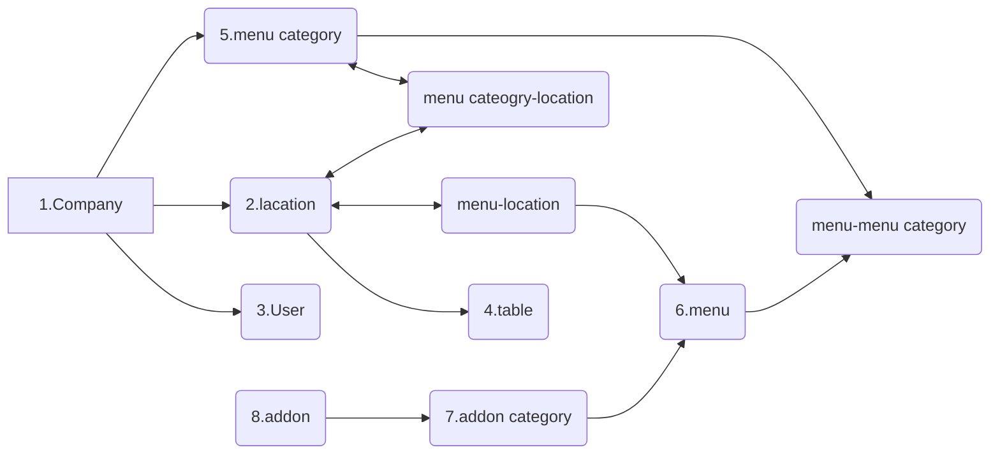

## MSquare Programming Fullstack Course

### Batch 2

### Episode-_26_ Summary

### Data modeling ( data structure )

- Data modeling ဆိုတာက project တစ်ခု မစခင်မှာ
  - data တွေကို စီမံခန့်ခွဲဖို့ အတွက် နည်းလမ်းတွေကို အရင်စဥ်းစားပြီး စီစဥ်ထားတာကို ဆိုလိုတာပါ
  - app တစ်ခုကို release လုပ်ပြီးမှ data model ကို ပြန်လည်ပြင်ဆင်မယ်ဆိုရင် ရှိပြီးသား data တွေ ပျက်သွားနိုင်သလို error လဲ ဖြစ်လာနိုင်တဲ့အတွက် **project တစ်ခု မစခင်မှာ data modeling လုပ်တာက အလွန်ကို အရေးပါတဲ့ အဆင့်တစ်ခု** ဖြစ်ပါတယ်

##

### Example Data modeling for class project ( like Grab/Food Panda app)

### Backoffice app

### Back office app အတွက် data model လုပ်ကြည့်တဲ့အခါ

- app ကို သုံးမယ့် company တွေ အတွက် `company` table တစ်ခုလုပ်ပါမယ်
- နောက်ပြီး company ရဲ့ ဆိုင်ခွဲတွေ အတွက် `location` table တစ်ခု လုပ်ပါမယ်
- company မှာ ရတဲ့ `menu category `တွေအတွက် table တစ်ခု လုပ်ပါမယ်
- အချို့ဆိုင်ခွဲတွေမှာ မရနိုင်မယ့် menu category တွေ ထည့်ထားလို့ရအောင် location ပေါ်မူတည်ပြီး menu category ကို disable လုပ်လို့ရမယ့် `location / menu category` table တစ်ခု လုပ်ပါမယ်
- ဆက်ပြီး `menu` table တစ်ခု လုပ်ပါမယ်
- အချို့ဆိုင်ခွဲတွေမှာ မရနိုင်မယ့် menu တွေ ထည့်ထားလို့ရအောင် location ပေါ်မူတည်ပြီး menu category ကို disable လုပ်လို့ရမယ့် `location / menu` table တစ်ခု လုပ်ပါမယ်
- `addon category` table တစ်ခုထပ်လုပ်ပြီး menu နဲ့တွဲပြီး ပြပေးနိုင်ဖို့ `menu/addon category` table တစ်ခု လုပ်ပါမယ်
- ဆက်ပြီး `addon` table တစ်ခု လုပ်ပြီး addon category နဲ့ ချိတ်ဆက်ပေးထားလိုက်ပါတယ်

## delete လုပ်တဲ့အခါ archived လုပ်ထားပေးဖို့ isArchived column နဲ့ အချိန်ကို သိမ်းထားပေးမယ့် createdAt/updatedAt column တွေကို တော့ database table တိုင်းမှာ ထည့်ပေးမှာမလို့ data model နမူနာမှာ မပြပေးထားပါဘူး

### နောက်ပြီး ခုံနံပါတ်တွေ နဲ့ order တွေ သိမ်းလို့ရမယ့် `tabel` table, `order` tabel တွေကို လဲ လောလောဆယ်မှာ မပြထားသေးတာကို သတိပြုပါ
