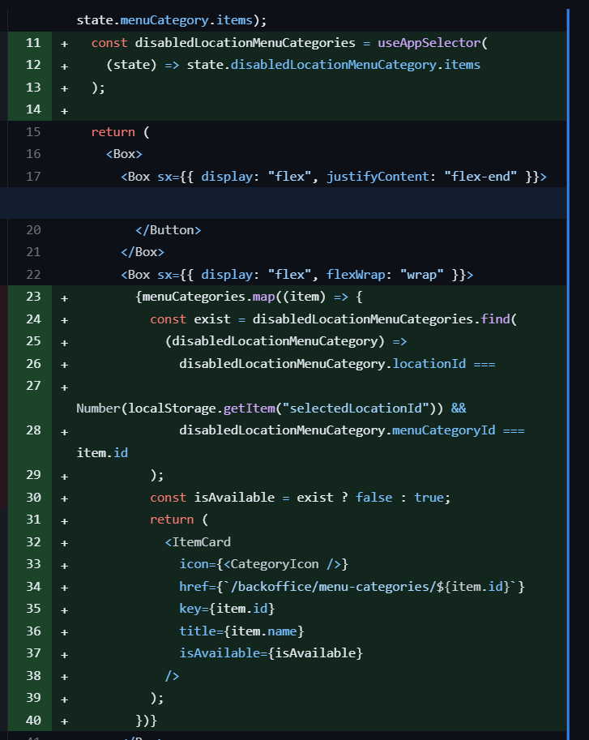
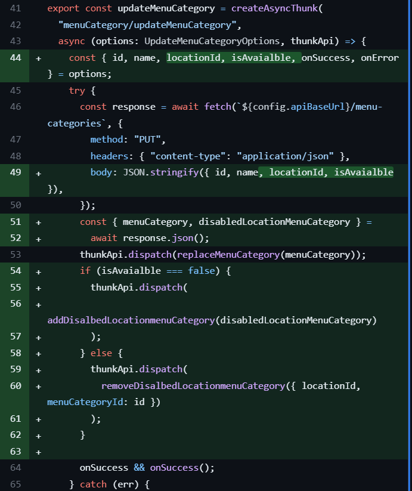

## MSquare Programming Fullstack Course

### Batch 2

### Episode-_38_ Summary

### create and upload QR code for tables

### Disable menu-category in locaton

### Setup Layout for Order App and Backoffice App

##

### create and upload QR code for tables

- table တစ်ခု create လုပ်လိုက်ရင် QR image တစ်ခု create လုပ်ပေးပြီး တစ်ခါတည်း Digital ocean မှာ upload လုပ်လိုက်မှာဖြစ်ပါတယ်

```console
$ npm i qrcode
```

- ပြီးရင် FileUpload.ts မှာ qrcode create and upload လုပ်ဖို့ ပြင်ဆင်လိုက်ပါမယ်

```js
export const generateLinkForQRCode = (companyId: number, tableId: number) => {
  return `${config.orderAppUrl}?companyId=${companyId}&tableId=${tableId}`;
};

export const qrCodeImageUpload = async (companyId: number, tableId: number) => {
  try {
    const qrImageData = await QRCode.toDataURL(
      generateLinkForQRCode(companyId, tableId)
    );
    const input = {
      Bucket: "msquarefdc",
      Key: `foodie-pos/msquarefdc/qrcode/companyId-${companyId}-tableId-${tableId}.png`,
      ACL: "public-read",
      Body: Buffer.from(
        qrImageData.replace(/^data:image\/\w+;base64,/, ""),
        "base64"
      ),
    };
    // @ts-ignore
    const command = new PutObjectCommand(input);
    await s3Client.send(command);
  } catch (err) {
    console.error(err);
  }
};

export const getQrCodeUrl = (companyId: number, tableId: number) => {
  return `https://msquarefdc.sgp1.cdn.digitaloceanspaces.com/foodie-pos/msquarefdc/qrcode/companyId-${companyId}-tableId-${tableId}.png`;
};
```

> ရှင်းလင်းချက်

```js
export const generateLinkForQRCode = (companyId: number, tableId: number) => {
  return `${config.orderAppUrl}?companyId=${companyId}&tableId=${tableId}`;
};
```

- user က create table လုပ်လိုက်ရင် order app url ရယ် အဲ့ဒီ table နဲ့ location id ရယ်ကို တွဲပြီး url တစ်ခုကို သတ်မှတ်လိုက်ပါတယ်

```js

```

```js
export const getQrCodeUrl = (companyId: number, tableId: number) => {
  return `https://msquarefdc.sgp1.cdn.digitaloceanspaces.com/foodie-pos/msquarefdc/qrcode/companyId-${companyId}-tableId-${tableId}.png`;
};
```

```js
export const qrCodeImageUpload = async (companyId: number, tableId: number) => {
  try {
    const qrImageData = await QRCode.toDataURL(
      generateLinkForQRCode(companyId, tableId)
    );
    const input = {
      Bucket: "msquarefdc",
      Key: `foodie-pos/msquarefdc/qrcode/companyId-${companyId}-tableId-${tableId}.png`,
      ACL: "public-read",
      Body: Buffer.from(
        qrImageData.replace(/^data:image\/\w+;base64,/, ""),
        "base64"
      ),
    };
    // @ts-ignore
    const command = new PutObjectCommand(input);
    await s3Client.send(command);
  } catch (err) {
    console.error(err);
  }
};
```

```js
export const qrCodeImageUpload = async (companyId: number, tableId: number) => {
  try {
    const qrImageData = await QRCode.toDataURL(
      generateLinkForQRCode(companyId, tableId)
    );
```

- qrcode module ကို သုံးပြီး အပေါ်မှာသတ်မှတ်ထားတဲ့ url ကို qr image အနေနဲ့ တည်ဆောက်လိုက်ပါတယ်

```js
const input = {
  Bucket: "msquarefdc",
  Key: `foodie-pos/msquarefdc/qrcode/companyId-${companyId}-tableId-${tableId}.png`,
  ACL: "public-read",
  Body: Buffer.from(
    qrImageData.replace(/^data:image\/\w+;base64,/, ""),
    "base64"
  ),
};
```

- input တစ်ခု သတ်မှတ်လိုက်ပြီး qrImageData ကို buffer လုပ်ကာ body အနေနဲ့ သတ်မှတ်ပြီး ထည့်ပေးထားပါတယ်
- key မှာလည်း file သိမ်းမယ့် path-name ကိုလည်း သတ်မှတ်ပေးလိုက်ပါတယ်

```js
const command = new PutObjectCommand(input);
await s3Client.send(command);
```

- နောက်ဆုံးမှာတော့ aws-sdk က PutObjectCommand ကို သုံးပြီး s3Client နဲ့ digital ocean space ဆီ upload လုပ်ပေးလိုက်တာပဲဖြစ်ပါတယ်

```js
export const getQrCodeUrl = (companyId: number, tableId: number) => {
  return `https://msquarefdc.sgp1.cdn.digitaloceanspaces.com/foodie-pos/msquarefdc/qrcode/companyId-${companyId}-tableId-${tableId}.png`;
};
```

- ဒါကတော့ upload လုပ်ထားတဲ့ url ကို database မှာ သိမ်းလို့ရအောင် ပြန်ပြီး သတ်မှတ်ထားလိုက်တာပဲ ဖြစ်ပါတယ်
- table တစ်ခု create လုပ်လိုက်ချိန်မှာ အထက်ပါ functionတွေကို သုံးပြီး database ထဲက table table မှာ assetUrl ကိုပါ တစ်ခါတည်း updateလုပ်ပေးလိုက်မှာဖြစ်ပါတယ်
- prisma schema ထဲက table model ထဲမှာ assestUrl column တစ်ခု ထပ်ထည့်ပြီး migrate လုပ်ပေးလိုက်ပါမယ်
  

- api အောက်က tables route မှာလည်း assetUrl ကို create လုပ်ပေးလိုက်ပါမယ်


##

### Disable menu-category in locaton

- menu category တွေကို location အလိုက် enable/disable လုပ်လို့ရအောင်သတ်မှတ်ပါမယ်
- အရင်ဆုံး disableLocationMenuCategory table ထဲက dataတွေကို /api/app routeကနေ လှမ်းယူလိုက်ပါမယ်


- အဲ့ဒီကနေ response ပြန်လာတဲ့ data ကို disableLocationMenuCategory slice တစ်ခု လုပ်ပြီး storeထဲမှာသိမ်းလိုက်ပါမယ်

```js
// src/store/slices/disableLocationMenuCategorySlice.ts

import { DisabledLocationMenuCategorySlice } from "@/types/disabledLocationMenuCategory";
import { PayloadAction, createSlice } from "@reduxjs/toolkit";

const initialState: DisabledLocationMenuCategorySlice = {
  items: [],
  isLoading: false,
  error: null,
};

const disabledLocationMenuCategorySlice = createSlice({
  name: "disabledLocationMenuCategorySlice",
  initialState,
  reducers: {
    setDisabledLocationMenuCategories: (state, action) => {
      state.items = action.payload;
    },
    addDisalbedLocationmenuCategory: (state, action) => {
      state.items = [...state.items, action.payload];
    },
    removeDisalbedLocationmenuCategory: (
      state,
      action: PayloadAction<{ locationId: number, menuCategoryId: number }>
    ) => {
      const { locationId, menuCategoryId } = action.payload;
      state.items = state.items.filter(
        (item) =>
          !(
            item.locationId === locationId &&
            item.menuCategoryId === menuCategoryId
          )
      );
    },
  },
});

export const {
  setDisabledLocationMenuCategories,
  addDisalbedLocationmenuCategory,
  removeDisalbedLocationmenuCategory,
} = disabledLocationMenuCategorySlice.actions;
export default disabledLocationMenuCategorySlice.reducer;
```

- setDisabledLocationMenuCategories ကို appSlice ထဲက fetchAppData thunk ကနေ dispatch လုပ်လိုက်ပါ။
  
- disabledLocationMenuCategorySlice ကို သုံးလို့အောင် store နဲ့ ချိတ်ဆက်ပေးလိုက်ပါမယ်

```js
// src/store/index.ts

import { configureStore } from "@reduxjs/toolkit";
import addonCategoryReducer from "./slices/addonCategorySlice";
import addonReducer from "./slices/addonSlice";
import appReducer from "./slices/appSlice";
import disabledLocationMenuCategoryReducer from "./slices/disabledLocationMenuCategorySlice";
import locationReducer from "./slices/locationSlice";
import menuAddonCategoryReducer from "./slices/menuAddonCategorySlice";
import menuCategoryMenuReducer from "./slices/menuCategoryMenuSlice";
import menuCategoryReducer from "./slices/menuCategorySlice";
import menuReducer from "./slices/menuSlice";
import snackBarReducer from "./slices/snackbarSlice";
import tableReducer from "./slices/tableSlice";

export const store = configureStore({
  reducer: {
    app: appReducer,
    location: locationReducer,
    menuCategory: menuCategoryReducer,
    menu: menuReducer,
    menuCategoryMenu: menuCategoryMenuReducer,
    addonCategory: addonCategoryReducer,
    menuAddonCategory: menuAddonCategoryReducer,
    addon: addonReducer,
    table: tableReducer,
    snackBar: snackBarReducer,
    disabledLocationMenuCategory: disabledLocationMenuCategoryReducer,
  },
});

// Infer the `RootState` and `AppDispatch` types from the store itself
export type RootState = ReturnType<typeof store.getState>;
// Inferred type: {posts: PostsState, comments: CommentsState, users: UsersState}
export type AppDispatch = typeof store.dispatch;
```

- menu -category page မှာလည်း itemတွေ ပြတဲ့အခါ disable ဖြစ်နေရင် opacity လျော့ပြီး ပြပေးနိုင်ဖို့ itemCard component မှာ isAvailable props တစ်ခု ထပ်ပြီး လက်ခံလိုက်ပါမယ်
  )
- isAvailable က false ဖြစ်ခဲ့ရင် itemCard ကို အရောင်လျော့ပြီး ပြပေးခိုင်းလိုက်တာဖြစ်ပါတယ်
- menu-category page မှာလည်း isAvailable ဖြစ်မဖြစ် စစ်ပြီး menu category တွေကို ပြပေးလိုက်မှာဖြစ်ပါတယ်



##

- ဆက်ပြီး menu category တွေကို enable/disable လုပ်နိုင်ဖို့ လုပ်ပါမယ်

```js
// src/pages/backoffice/menu-categories/[id]/index.tsx


const MenuCategoryDetail = () => {
  const router = useRouter();
  const menuCategoryId = Number(router.query.id);
  const menuCategories = useAppSelector((state) => state.menuCategory.items);
  const menuCategory = menuCategories.find(
    (item) => item.id === menuCategoryId
  );

  const locationId =  Number(localStorage.getItem("selectedLocationId"))
  const [data, setData] = useState<UpdateMenuCategoryOptions>();
  const dispatch = useAppDispatch();
  const [open, setOpen] = useState(false);
  const disalbedLocationmenuCategories = useAppSelector(
    (state) => state.disabledLocationMenuCategory.items
  );

  useEffect(() => {
    if (menuCategory) {
      const disalbedLocationmenuCategory = disalbedLocationmenuCategories.find(
        (item) =>
          item.locationId === locationId && item.menuCategoryId === menuCategoryId
      );
      console.log(disalbedLocationmenuCategory);
      setData({
        ...menuCategory,
        locationId,
        isAvaialble: disalbedLocationmenuCategory ? false : true,
      });
    }
  }, [menuCategory, disalbedLocationmenuCategories]);

  if (!menuCategory || !data) return null;

  const handleUpdateMenuCategory = () => {
    dispatch(
      updateMenuCategory({
        ...data,
        locationId,
      })
    );
  };

  const handleDeleteMenuCategory = () => {
 ........
  };

  return (
    <Box sx={{ display: "flex", flexDirection: "column" }}>
      <Box sx={{ display: "flex", justifyContent: "flex-end", mb: 2 }}>
        <Button variant="outlined" color="error" onClick={() => setOpen(true)}>
          Delete
        </Button>
      </Box>
      <TextField
        defaultValue={menuCategory.name}
        sx={{ mb: 2 }}
        onChange={(evt) =>
          setData({ ...data, id: menuCategoryId, name: evt.target.value })
        }
      />
      <FormControlLabel
        control={
          <Switch
            defaultChecked={data.isAvaialble}
            onChange={(evt, value) => setData({ ...data, isAvaialble: value })}
          />
        }
        label="Available"
      />
      <Button
        variant="contained"
        sx={{ mt: 2, width: "fit-content" }}
        onClick={handleUpdateMenuCategory}
      >
        Update
      </Button>
      <Dialog open={open} onClose={() => setOpen(false)}>
        ........
      </Dialog>
    </Box>
  );
};

export default MenuCategoryDetail;
```

- locationId ကို localstorage ထဲကနေ လှမ်းယူလိုက်ပြီး အဲ့ဒီ id ရယ် menu category id ရယ် ပါတဲ့ row ကို disable table ထဲမှာ ရှိမရှိ စစ်လိုက်ပြီး
- မရှိခဲ့ရင် isAvailable ကို true , ရှိခဲ့ရင် false လို့သတ်မှတ်ပေးလိုက်ပါတယ်
- return ထဲမှာလဲ switch တစ်ခု ထည့်းပေးထားပြီး disable/ enable လုပ်လို့ရအောင် state ကို update လုပ်ပေးလိုက်ပါတယ်
- update confrim လုပ်လိုက်တဲ့အခါမှာ ထည့်ပေးလိုက်တဲ့ isAvaialble တန်ဖိုးပေါ်မူတည်ပြီး disable tableမှာ UPDATE လုပ်ပေးလိုက်မှာဖြစ်ပါတယ်

```js
// src/pages/api/menu-categories/index.tsx --> PUT method

..........
........
 } else if (method === "PUT") {
    const { id, name, locationId, isAvaialble } = req.body;
    const isValid = id && name;
    if (!isValid) return res.status(400).send("Bad request.");
    const exist = await prisma.menuCategory.findFirst({
      where: { id },
    });
    if (!exist) return res.status(400).send("Bad request.");
    const menuCategory = await prisma.menuCategory.update({
      data: { name },
      where: { id },
    });
    if (locationId && isAvaialble === false) {
      const exist = await prisma.disabledLocationMenuCategory.findFirst({
        where: { menuCategoryId: id, locationId },
      });
      if (exist)
        return res
          .status(200)
          .json({ menuCategory, disabledLocationMenuCategory: exist });

      const disabledLocationMenuCategory =
        await prisma.disabledLocationMenuCategory.create({
          data: { locationId, menuCategoryId: id },
        });
      return res
        .status(200)
        .json({ menuCategory, disabledLocationMenuCategory });
    } else if (locationId && isAvaialble === true) {
      const exist = await prisma.disabledLocationMenuCategory.findFirst({
        where: { menuCategoryId: id, locationId },
      });
      if (exist) {
        await prisma.disabledLocationMenuCategory.delete({
          where: { id: exist.id },
        });
      }
      return res
        .status(200)
        .json({ menuCategory, disabledLocationMenuCategory: exist });
    } else {
      return res.status(200).json({ menuCategory });
    }
  } else if (method === "DELETE") {.....}

```

- request body ထဲမှာ locationId နဲ့ isAvailable false တို့ ပါလာခဲ့ရင် disable table မှာ ထည့်ထားပြီးသားရှိမရှိ စစ်လိုက်ပြီး မရှိသေးရင် disable table ထဲထည့်ပေးလိုက်ပါတယ်
- locationId နဲ့ isAvailable true တို့ ပါလာခဲ့ရင် disable table မှာ ထည့်ထားပြီးသားရှိမရှိ စစ်လိုက်ပြီး ရှိခဲ့ရင် disable table ထဲကနေ delete လုပ်ပေးလိုက်ပါတယ်
- menu category slice ထဲမှာလည်း disabledLocationMenuCategorySlice ကို updateMenuCategory action မှာ disaptch လုပ်ပြီး update လုပ်ပေးရမှာဖြစ်ပါတယ်



##

## Update Layout component

### Setup Layout for Order App and Backoffice App

- Order App ကိုလည်း စလုပ်တော့မှာမို့လို့ Layout တွေကို အရင် ခွဲထားလိုက်ပါမယ်

- အရင်က Layout component ကို BackofficeLayout.tsx လို့ နာမည်ပြောင်းလိုက်ပါမယ်

```js
// src/component/Layout.tsx --> BackofficeLayout.tsx

import { useAppDispatch, useAppSelector } from "@/store/hooks";
import { fetchAppData } from "@/store/slices/appSlice";
import { Box } from "@mui/material";
import { useSession } from "next-auth/react";
import { ReactNode, useEffect } from "react";
import SideBar from "./Sidebar";
import Topbar from "./Topbar";

interface Props {
  children: ReactNode;
}

const BackofficeLayout = ({ children }: Props) => {
  const { data: session } = useSession();
  const dispatch = useAppDispatch();
  const { init } = useAppSelector((state) => state.app);

  useEffect(() => {
    if (session && !init) {
      dispatch(fetchAppData({}));
    }
  }, [session]);

  return (
    <Box>
      <Topbar />
      <Box sx={{ display: "flex", position: "relative", zIndex: 5, flex: 1 }}>
        {session && <SideBar />}
        <Box sx={{ p: 3, width: "100%", height: "100%" }}>{children}</Box>
      </Box>
    </Box>
  );
};

export default BackofficeLayout;
```

- ပြီးရင် OrderLayout component နဲ့ Layout component ထပ်လုပ်လိုက်ပါမယ်

```js
// src/components/OrderLayout.tsx

import { Box } from "@mui/material";

interface Props {
  children: string | JSX.Element | JSX.Element[];
}

const OrderLayout = ({ children }: Props) => {
  return <Box>{children}</Box>;
};

export default OrderLayout;
```

```js
// src/components/Layout

import BackofficeLayout from "@/components/BackofficeLayout";
import { Box } from "@mui/material";
import { useRouter } from "next/router";
import OrderLayout from "./OrderLayout";

interface Props {
  children: string | JSX.Element | JSX.Element[];
}

const Layout = ({ children }: Props) => {
  const router = useRouter();
  const isOrderApp = router.pathname === "/order";
  const isBackofficeApp = router.pathname.includes("/backoffice");

  if (isOrderApp) {
    return (
      <Box sx={{ height: "100%" }}>
        <OrderLayout>{children}</OrderLayout>
      </Box>
    );
  }

  if (isBackofficeApp) {
    return (
      <Box sx={{ height: "100%" }}>
        <BackofficeLayout>{children}</BackofficeLayout>
      </Box>
    );
  }

  return <Box>{children}</Box>;
};

export default Layout;
```

- Layout component အသစ်မှာတော့ order app ထဲ၀င်လာရင် OrderLayout component ကို ပြပေးထားပြီး
- backoffice app ထဲ ၀င်လာရင်တော့ BackofficeLayout ကို ပြပေးထားလိုက်ပါတယ်

##

### Pages အောက်က index.tsx ကို backoffice/index.tsx အဖြစ် ပြောင်းထားပေးလိုက်မှာဖြစ်ပြီး Pages အောက်မှာ index.tsx အသစ်နဲ့ landing page အဖြစ် ပြပေးဖို့ ပြင်ဆင်ထားပါမယ်

```js
// src/pages/backoffice/index.tsx

import { Box, Button } from "@mui/material";
import { signIn, useSession } from "next-auth/react";
import { useRouter } from "next/router";

export default function Home() {
  const { data } = useSession();
  const router = useRouter();
  if (!data) {
    return (
      <Box
        sx={{
          display: "flex",
          justifyContent: "center",
          alignItems: "center",
          height: "80vh",
        }}
      >
        <Button
          variant="contained"
          onClick={() => signIn("google", { callbackUrl: "/backoffice" })}
        >
          Sign in
        </Button>
      </Box>
    );
  } else {
    router.push("/backoffice/orders");
  }
}
```

```js
// src/pages/index.tsx

export default function Home() {
  return <h1>Welcome to Foodie POS</h1>;
}
```

- order app အတွက်လည်း order page တစ်ခုကို create လုပ်ပေးထားလိုက်ပါမယ်

```js
// src/pages/order/index.tsx

const OrderApp = () => {
  return <h1>Order app</h1>;
};

export default OrderApp;
```

##
