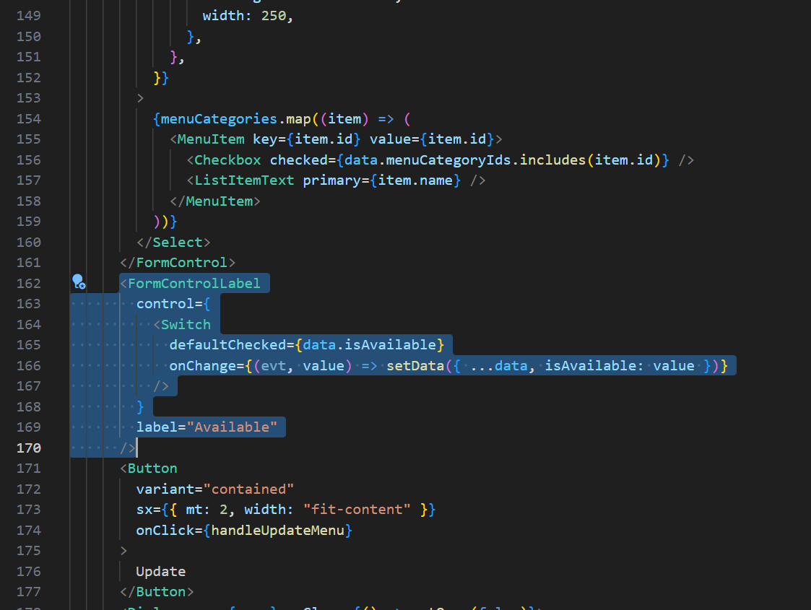
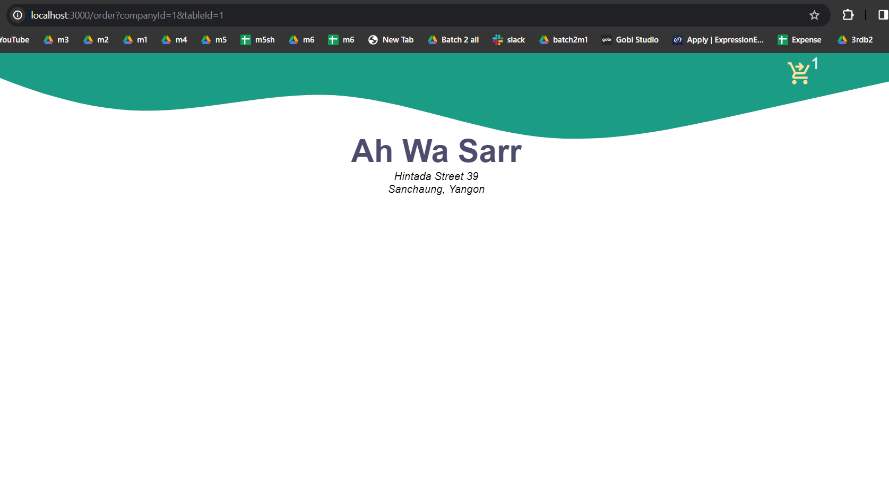
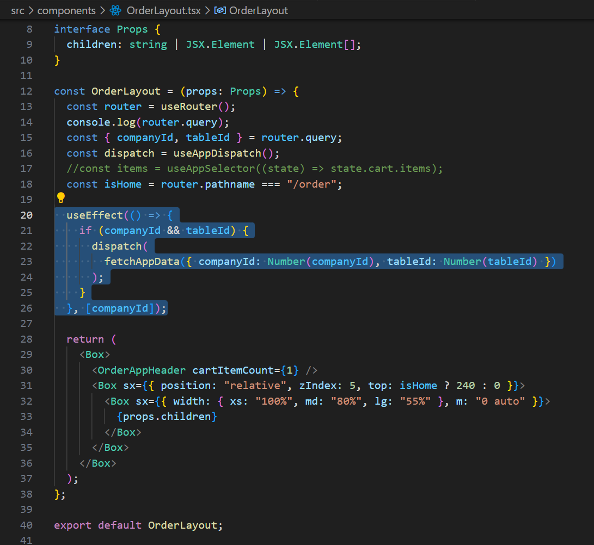
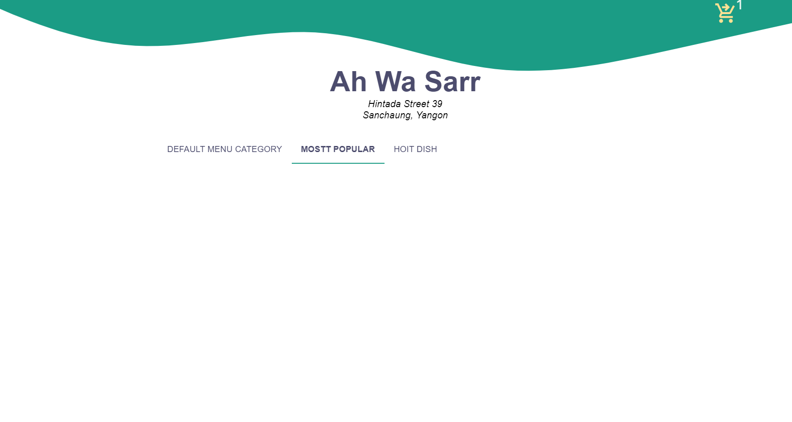
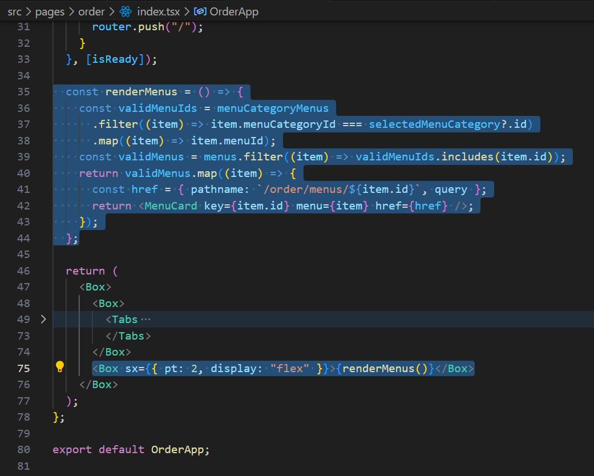
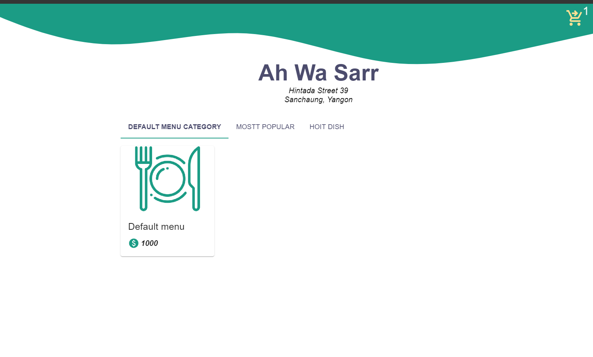

## MSquare Programming Fullstack Course

### Batch 2

### Episode-_38_ Summary

##

### 1. Disable Menus in location

### 2. Print Table QR image

### 3. order app (Layout , Get data , display menu-category/menu using MUI Tabs component)

##

### 1. Disable Menus in location

- ပြီးခဲ့တဲ့ သင်ခန်းစာမှာ menu-category ကို disable လုပ်ခဲ့ သလိုမျိုး menu တွေကို location အလိုက် disablde လုပ်လို့ရအောင် ဆက်လုပ်ပါမယ်
- အရင်ဆုံး disableLocationMenuSlice တစ်ခုလုပ်ပြီး disable data တွေကို store ထဲမှာ ထားလိုက်ပါမယ်

```js
import { DisabledLocationMenuSlice } from "@/types/disableLocationMenu";

import { PayloadAction, createSlice } from "@reduxjs/toolkit";

const initialState: DisabledLocationMenuSlice = {
  items: [],
  isLoading: false,
  error: null,
};

const DisabledLocationMenuSlice = createSlice({
  name: "DisabledLocationMenuSlice",
  initialState,
  reducers: {
    setDisabledLocationMenu: (state, action) => {
      state.items = action.payload;
    },
    addDisabledLocationMenu: (state, action) => {
      state.items = [...state.items, ...action.payload];
    },
    deleteDisabledLocationMenu: (state, action) => {
      state.items = state.items.filter((item) => item.id !== action.payload.id);
    },
  },
});

export const {
  setDisabledLocationMenu,
  addDisabledLocationMenu,
  deleteDisabledLocationMenu,
} = DisabledLocationMenuSlice.actions;
export default DisabledLocationMenuSlice.reducer;
```

- menu update လုပ်တဲ့ menuUpdate page မှာလည်း switch တစ်ခုထည့်ပြီး available/disable လုပ်လို့ရအောင် လုပ်လိုက်ပါမယ်
- 

```js

```

- ရလာတဲ့ available value ပေါ် မူတည်ပြီး database ထဲက disableLocationMenu table မှာ row တွေ ဖြူတ်/ထည့် လုပ်ပေးလိုက်ပါမယ်

```js
// src/pages/api/menus/index.ts --> PUT method

} else if (method === "PUT") {
    const { id, name, price, menuCategoryIds, locationId, isAvailable } =
      req.body;
    const isValid =
      id && name && price !== undefined && menuCategoryIds.length > 0;
    if (!isValid) return res.status(400).send("Bad request.");
    const menu = await prisma.menu.update({
      data: { name, price },
      where: { id },
    });
    // update menuCategoryMenu table
    await prisma.menuCategoryMenu.deleteMany({ where: { menuId: id } });
    const menuCategoryMenusData: { menuId: number; menuCategoryId: number }[] =
      menuCategoryIds.map((item: number) => ({
        menuId: id,
        menuCategoryId: item,
      }));
    const menuCategoryMenus = await prisma.$transaction(
      menuCategoryMenusData.map((item) =>
        prisma.menuCategoryMenu.create({
          data: item,
        })
      )
    );
    if (locationId) {
      if (isAvailable === false) {
        const exist = await prisma.disabledLocationMenu.findFirst({
          where: { menuId: id },
        });
        if (!exist) {
          await prisma.disabledLocationMenu.create({
            data: { locationId, menuId: id },
          });
        }
      } else {
        await prisma.disabledLocationMenu.deleteMany({
          where: { locationId, menuId: id },
        });
      }
    }
    const disabledLocationMenus = await prisma.disabledLocationMenu.findMany({
      where: { menuId: id },
    });
    return res
      .status(200)
      .json({ menu, menuCategoryMenus, disabledLocationMenus });
  } else if (method === "DELETE") {
```

- menuSlice ထဲက updateMenu thunk မှာလည်း available value ပေါ် မူတည်ပြီး store ကို update လုပ်ပေးလိုက်မှာဖြစ်ပါတယ်

```js
// src/store/slices/menuSlice.ts --> updateMenu action

export const updateMenu = createAsyncThunk(
  "menu/updateMenu",
  async (options: UpdateMenuOptions, thunkApi) => {
    console.log(options);
    const {
      id,
      name,
      price,
      menuCategoryIds,
      locationId,
      isAvailable,
      onSuccess,
      onError,
    } = options;
    try {
      const response = await fetch(`${config.apiBaseUrl}/menus`, {
        method: "PUT",
        headers: { "content-type": "application/json" },
        body: JSON.stringify({
          id,
          name,
          price,
          menuCategoryIds,
          locationId,
          isAvailable,
        }),
      });
      const { menu, menuCategoryMenus, disabledLocationMenus } =
        await response.json();
      thunkApi.dispatch(replaceMenu(menu));
      thunkApi.dispatch(replaceMenuCategoryMenu(menuCategoryMenus));
      if (isAvailable === false) {
        thunkApi.dispatch(addDisabledLocationMenu(disabledLocationMenus));
      } else {
        thunkApi.dispatch(
          removeDisabledLocationMenu({ locationId, menuId: id })
        );
      }
      onSuccess && onSuccess();
    } catch (err) {
      onError && onError();
    }
  }
);
```

- menu တွေကို ပြတဲ့အခါ Disableဖြစ်တဲ့ menu တွေကိုအရောင်မှိန်ပြီးပြပေးနိုင်ဖို့ MenuCard component မှာ isAvailable props တစ်ခု ထပ်လက်ခံပြီး opacityကို ထိန်းချုပ်လိုက်ပါမယ်

```js
// src/pages/backoffice/menus/index.tsx

import MenuCard from "@/components/MenuCard";
import NewMenu from "@/components/NewMenu";
import { useAppSelector } from "@/store/hooks";
import { Box, Button } from "@mui/material";
import { useState } from "react";

const MenusPage = () => {
  const [open, setOpen] = useState(false);
  const menus = useAppSelector((state) => state.menu.items);
  const disabledLocationMenus = useAppSelector(
    (state) => state.disabledLocationMenu.items
  );
  return (
    <Box>
      <Box sx={{ display: "flex", justifyContent: "flex-end" }}>
        <Button variant="contained" onClick={() => setOpen(true)}>
          New menu
        </Button>
      </Box>
      <Box sx={{ display: "flex", flexWrap: "wrap" }}>
        {menus.map((item) => {
          const exist = disabledLocationMenus.find(
            (disabledLocationMenu) =>
              disabledLocationMenu.locationId ===
                Number(localStorage.getItem("selectedLocationId")) &&
              disabledLocationMenu.menuId === item.id
          );
          const isAvailable = exist ? false : true;
          return (
            <MenuCard
              href={`/backoffice/menus/${item.id}`}
              key={item.id}
              menu={item}
              isAvailable={isAvailable}
            />
          );
        })}
      </Box>
      <NewMenu open={open} setOpen={setOpen} />
    </Box>
  );
};

export default MenusPage;
```

```js
// src/components/MenuCard.tsx

import PaidIcon from "@mui/icons-material/Paid";
import { Box, Card, CardContent, CardMedia, Typography } from "@mui/material";
import { Menu } from "@prisma/client";
import Link from "next/link";

interface Props {
  menu: Menu;
  href: string | object;
  isAvailable?: boolean;
}

const MenuCard = ({ menu, href, isAvailable }: Props) => {
  return (
    <Link
      key={menu.id}
      href={href}
      style={{
        textDecoration: "none",
        marginRight: "15px",
        marginBottom: "20px",
      }}
    >
      <Card
        title={isAvailable === false ? "Unavailable" : ""}
        sx={{
          width: 200,
          height: 220,
          pb: 2,
          opacity: isAvailable === false ? 0.4 : 1,
        }}
      >
        <CardMedia
          sx={{ height: 140, objectFit: "contain" }}
          image={menu.assetUrl || "/default-menu.png"}
          component={"div"}
        />
        <CardContent>
          <Typography gutterBottom variant="h6" sx={{ mb: 0 }}>
            {menu.name}
          </Typography>
          <Box
            sx={{
              display: "flex",
              justifyContent: "flex-start",
              alignItems: "center",
            }}
          >
            <PaidIcon color="success" />
            <Typography
              gutterBottom
              variant="subtitle1"
              sx={{ mt: 0.8, ml: 0.4, fontWeight: "bold", fontStyle: "italic" }}
            >
              {menu.price}
            </Typography>
          </Box>
        </CardContent>
      </Card>
    </Link>
  );
};

export default MenuCard;
```

##

### 2. Print Table QR image

- table တစ်ခု create လုပ် လိုက်တိုင်း QR image တစ်ခုပါ လုပ်ပေးခဲ့ပြီး digital ocean spaceမှာ uploadလုပ်ခဲ့ကြပါတယ်
- အဲ့ဒီ image တွေကို print ထုတ်လို့ရအောင် လုပ်ပေးလိုက်ပါမယ်

```js
// src/pages/backoffice/tables/index.tsx

import ItemCard from "@/components/ItemCard";
import NewTable from "@/components/NewTable";
import { useAppSelector } from "@/store/hooks";
import TableBarIcon from "@mui/icons-material/TableBar";
import { Box, Button } from "@mui/material";
import { useState } from "react";

const TablesPage = () => {
  const [open, setOpen] = useState(false);
  const tables = useAppSelector((state) => state.table.items);

  const handleQRImagePrint = (assetUrl: string) => {
    const imageWindow = window.open("");
    imageWindow?.document.write(
      `<html><head><title>Print Image</title></head><body style="text-align: center;"></body></html>`
    );
    imageWindow?.document.close();
  };

  return (
    <Box>
      <Box sx={{ display: "flex", justifyContent: "flex-end" }}>
        <Button variant="contained" onClick={() => setOpen(true)}>
          New table
        </Button>
      </Box>
      <Box sx={{ display: "flex", flexWrap: "wrap" }}>
        {tables.map((item) => (
          <Box
            sx={{
              display: "flex",
              flexDirection: "column",
              alignItems: "center",
            }}
          >
            <ItemCard
              href={`/backoffice/tables/${item.id}`}
              icon={<TableBarIcon fontSize="large" />}
              key={item.id}
              title={item.name}
            />
            <Button
              variant="contained"
              onClick={() => handleQRImagePrint(item.assetUrl)}
            >
              Print QR
            </Button>
          </Box>
        ))}
      </Box>
      <NewTable open={open} setOpen={setOpen} />
    </Box>
  );
};

export default TablesPage;
```

##

### 3. Order app

### Update order app layout

- order app layout ကို logo+ bg image + cart icon တွေပါတဲ့ appbar တစ်ခု နဲ့ ထည့်ပြီး ပြပေးလိုက်ပါမယ်

```js
// src/component/OrderAppHeadBar.tsx

import ShoppingCartCheckoutIcon from "@mui/icons-material/ShoppingCartCheckout";
import { Box, Typography } from "@mui/material";
import Image from "next/image";
import { useRouter } from "next/router";
import React from "react";
import OrderAppHeaderImg from "../assets/order-app-header.svg";

interface Props {
  cartItemCount: number;
}

const OrderAppHeader = ({ cartItemCount }: Props) => {
  const router = useRouter();
  const isHome = router.pathname === "/order?dkd";
  const isCart = router.pathname === "/order/cart";
  const isActiveOrder = router.pathname.includes("/order/activeOrder");
  const showCartIcon = !isCart && !isActiveOrder;

  return (
    <Box
      sx={{
        width: "100vw",
        display: "flex",
        flexDirection: "column",
        alignItems: "center",
        position: "fixed",
        zIndex: 5,
      }}
    >
      {showCartIcon && (
        <Box
          sx={{
            position: "absolute",
            top: 10,
            right: { xs: 40, md: 80, lg: 200 },
            cursor: "pointer",
          }}
          onClick={() =>
            router.push({ pathname: "/order/cart", query: router.query })
          }
        >
          <ShoppingCartCheckoutIcon
            sx={{
              fontSize: "40px",
              color: "#FFE194",
            }}
          />
          {cartItemCount > 0 && (
            <Typography
              variant="h5"
              sx={{
                textAlign: "right",
                color: "#E8F6EF",
                position: "absolute",
                top: -10,
                right: -10,
              }}
            >
              {cartItemCount}
            </Typography>
          )}
        </Box>
      )}

      <Image
        src={OrderAppHeaderImg}
        style={{
          width: "100%",
          padding: 0,
          margin: 0,
          objectFit: "cover",
        }}
        alt="header-image"
      />
      {isHome && (
        <Box sx={{ position: "absolute" }}>
          <Box sx={{ textAlign: "center" }}>
            <Typography
              variant="h3"
              sx={{
                fontWeight: "bold",
                color: "#4C4C6D",
                mt: 15,
              }}
            >
              Ah Wa Sarr
            </Typography>
            <Typography
              variant="body1"
              sx={{ fontStyle: "italic", lineHeight: 1.2 }}
            >
              Hintada Street 39
              <br /> Sanchaung, Yangon
            </Typography>
          </Box>
        </Box>
      )}
    </Box>
  );
};

export default React.memo(OrderAppHeader);
```

```js
// src/components/OrderLayout.tsx

import { useAppDispatch } from "@/store/hooks";
import { fetchAppData } from "@/store/slices/appSlice";
import { Box } from "@mui/material";
import { useRouter } from "next/router";
import { useEffect } from "react";
import OrderAppHeader from "./OrderAppHeader";

interface Props {
  children: string | JSX.Element | JSX.Element[];
}

const OrderLayout = (props: Props) => {
  const router = useRouter();
  console.log(router.query);
  const { companyId, tableId } = router.query;
  const dispatch = useAppDispatch();
  //const items = useAppSelector((state) => state.cart.items);
  const isHome = router.pathname === "/order";

  return (
    <Box>
      <OrderAppHeader cartItemCount={1} />
      <Box sx={{ position: "relative", zIndex: 5, top: isHome ? 240 : 0 }}>
        <Box sx={{ width: { xs: "100%", md: "80%", lg: "55%" }, m: "0 auto" }}>
          {props.children}
        </Box>
      </Box>
    </Box>
  );
};

export default OrderLayout;
```



- backoffice app တုန်းကလိုပဲ order app ထဲ ၀င်လာတာနဲ့ လိုအပ်တဲ့ data တွေကို appFetchData action ကို dispatch လုပ်ပြီး လှမ်းယူလိုက်မှာဖြစ်ပါတယ်



```js
// src/pages/api/app/index.ts --> GET method

const method = req.method;
  const { companyId, tableId } = req.query;
  const isOrderAppRequest = companyId && tableId;
  if (method === "GET") {
    if (isOrderAppRequest) {
      let menuCategories = await prisma.menuCategory.findMany({
        where: { companyId: Number(companyId), isArchived: false },
      });
      const menuCategoryIds = menuCategories.map((item) => item.id);
      const disabledMenuCategoryIds = (
        await prisma.disabledLocationMenuCategory.findMany({
          where: { menuCategoryId: { in: menuCategoryIds } },
        })
      ).map((item) => item.menuCategoryId);

      menuCategories = menuCategories.filter(
        (item) => !disabledMenuCategoryIds.includes(item.id)
      );

      const menuCategoryMenus = await prisma.menuCategoryMenu.findMany({
        where: { menuCategoryId: { in: menuCategoryIds }, isArchived: false },
      });
      const menuIds = menuCategoryMenus.map((item) => item.menuId);
      const disabledMenuIds = (
        await prisma.disabledLocationMenu.findMany({
          where: { menuId: { in: menuIds } },
        })
      ).map((item) => item.menuId);
      const menus = (
        await prisma.menu.findMany({
          where: { id: { in: menuIds }, isArchived: false },
        })
      ).filter((item) => !disabledMenuIds.includes(item.id));
      const menuAddonCategories = await prisma.menuAddonCategory.findMany({
        where: { menuId: { in: menuIds }, isArchived: false },
      });
      const addonCategoryIds = menuAddonCategories.map(
        (item) => item.addonCategoryId
      );
      const addonCategories = await prisma.addonCategory.findMany({
        where: { id: { in: addonCategoryIds }, isArchived: false },
      });
      const addons = await prisma.addon.findMany({
        where: {
          addonCategoryId: { in: addonCategoryIds },
          isArchived: false,
        },
      });
      return res.status(200).json({
        locations: [],
        menuCategories,
        menus,
        menuCategoryMenus,
        menuAddonCategories,
        addonCategories,
        addons,
        tables: [],
        disabledLocationMenuCategories: [],
        disabledLocationMenus: [],
      });
    } else{.......}

```

- /api/app route ထဲ request၀င်လာရင် company id နဲ့ table id ပါလာခဲ့ပါက order app က request လုပ်လိုက်တာမလို့ backoffice app က request လို အကုန်လုံးကို ယူမှာ မဟုတ်ပဲ လိုအပ်တဲ့data တွေကိုပဲ ယူလိုက်တာဖြစ်ပါတယ်
- menu category နဲ့ menu တွေကို လှမ်းယူတဲ့အချိန်မှာလည်း disable table ထဲမှာ ရှိနေတဲ့ item တွေကို မယူပဲ ချန်ထားခဲ့လိုက်ပါတယ်

##

- ရလာတဲ့ data တွေထဲကမှ menu category ကို MUI Tabs component နဲ့ order app home page မှာ ပြပေးလိုက်မှာဖြစ်ပါတယ်

```js
import MenuCard from "@/components/MenuCard";
import { useAppSelector } from "@/store/hooks";
import Box from "@mui/material/Box";
import Tab from "@mui/material/Tab";
import Tabs from "@mui/material/Tabs";
import { MenuCategory } from "@prisma/client";
import { useRouter } from "next/router";
import { useEffect, useState } from "react";

const OrderApp = () => {
  const { isReady, ...router } = useRouter();
  const query = router.query;
  const companyId = query.companyId as string;
  const menuCategories = useAppSelector((state) => state.menuCategory.items);
  const menuCategoryMenus = useAppSelector(
    (state) => state.menuCategoryMenu.items
  );
  const menus = useAppSelector((state) => state.menu.items);
  const [value, setValue] = useState(0);
  const [selectedMenuCategory, setSelectedMenuCategory] =
    useState<MenuCategory>();

  useEffect(() => {
    if (menuCategories.length) {
      setSelectedMenuCategory(menuCategories[0]);
    }
  }, [menuCategories]);

  useEffect(() => {
    if (isReady && !companyId) {
      router.push("/");
    }
  }, [isReady]);


  return (
    <Box>
      <Box>
        <Tabs
          TabIndicatorProps={{
            style: { background: "#1B9C85" },
          }}
          value={value}
          onChange={(evt, value) => setValue(value)}
          variant="scrollable"
          sx={{
            ".Mui-selected": {
              color: "#1B9C85",
              fontWeight: "bold",
            },
          }}
        >
          {menuCategories.map((item) => {
            return (
              <Tab
                key={item.id}
                label={item.name}
                sx={{ color: "#4C4C6D" }}
                onClick={() => setSelectedMenuCategory(item)}
              />
            );
          })}
        </Tabs>
      </Box>

    </Box>
  );
};

export default OrderApp;

```



- menu category tab တစ်ခုခုကို နှိပ်လိုက်ရင် အဲ့ဒီ category အောက်မှာရှိတဲ့ menu တွေကို ပြပေးနိုင်အောင် renderMenu ဆိုတဲ့ function တစ်ခု သတ်မှတ်ပြီး ခေါ်သုံးပေးလိုက်မှာဖြစ်ပါတယ်




