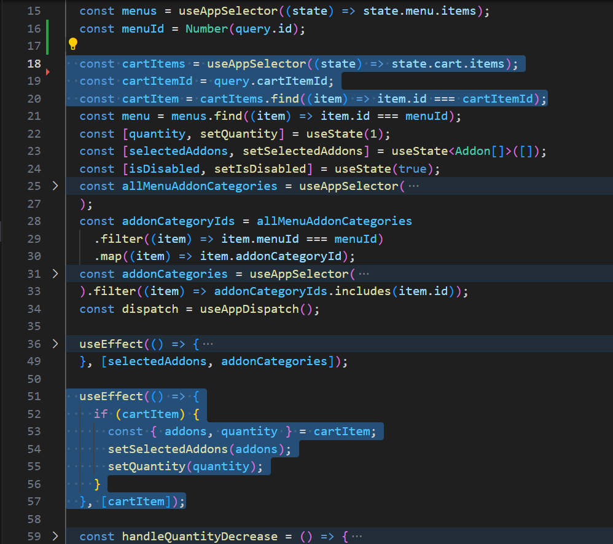

## MSquare Programming Fullstack Course

### Batch 2

### Episode-_41_ Summary

##

### 1 . Add menu to cart

### 2. Cart page

### 3. Edit cart item

##

### 1 . Add menu to cart

- ပြီးခဲ့တဲ့ သင်ခန်းစာမှာ menu တစ်ခုကို cartထဲ ထည့်လို့ရအောင် ပြင်ဆင်ခဲ့ကြပါတယ်
- cart ထဲကို ထည့်ဖို့ button တစ်ခု ထည့်လိုက်ပြီး cart page မှာ ထည့်ထားတဲ့ menu item တွေ ပြပေးနိုင်အောင် လုပ်ပါမယ်
- ပြီးခဲ့တဲ့ သင်ခန်းစာမှာ select လုပ်လိုက်တဲ့ addon id တွေပဲ selectedAddonIds ဆိုတဲ့ state နဲ့ သိမ်းခဲ့ကြပါတယ်
- ခု သင်ခန်းစာမှာ id တွေ ပဲ မသိမ်းတော့ပဲ addon object တစ်ခုလုံးကို သိမ်းမှာဖြစ်ပါတယ်
- Menu detail page ,AddonCategory နဲ့ Addon component တွေမှာ code တွေကို update လုပ်ပေးလိုက်ပါမယ်

```js

// src/pages/order/menus/[id]/index.tsx

import AddonCategories from "@/components/AddonCategories";
import QuantitySelector from "@/components/QuantitySelector";
import { useAppDispatch, useAppSelector } from "@/store/hooks";
import { Box, Button } from "@mui/material";
import { Addon } from "@prisma/client";
import Image from "next/image";
import { useRouter } from "next/router";
import { useEffect, useState } from "react";

const MenuDetail = () => {
  const { query, isReady, ...router } = useRouter();
  const menus = useAppSelector((state) => state.menu.items);

  const menuId = Number(query.id);

  const menu = menus.find((item) => item.id === menuId);
  const [quantity, setQuantity] = useState(1);

  const [selectedAddons, setSelectedAddons] = useState<Addon[]>([]);

  const allMenuAddonCategories = useAppSelector(
    (state) => state.menuAddonCategory.items
  );
  const addonCategoryIds = allMenuAddonCategories
    .filter((item) => item.menuId === menuId)
    .map((item) => item.addonCategoryId);
  const addonCategories = useAppSelector(
    (state) => state.addonCategory.items
  ).filter((item) => addonCategoryIds.includes(item.id));
  const dispatch = useAppDispatch();

  useEffect(() => {
    const requiredAddonCategories = addonCategories.filter(
      (item) => item.isRequired
    );
    const selectedRequiredAddons = selectedAddons.filter((selectedAddon) => {
      const addonCategory = addonCategories.find(
        (item) => item.id === selectedAddon.addonCategoryId
      );
      return addonCategory?.isRequired ? true : false;
    });
    const isDisabled =
      requiredAddonCategories.length !== selectedRequiredAddons.length;
    setIsDisabled(isDisabled);
  }, [selectedAddons, addonCategories]);

  useEffect(() => {
    if (cartItem) {
      const { addons, quantity } = cartItem;
      setSelectedAddons(addons);
      setQuantity(quantity);
    }
  }, [cartItem]);

  const handleQuantityDecrease = () => {
    const newValue = quantity - 1 === 0 ? 1 : quantity - 1;
    setQuantity(newValue);
  };

  const handleQuantityIncrease = () => {
    const newValue = quantity + 1;
    setQuantity(newValue);
  };


  if (!isReady || !menu) return null;

  return (
    <Box sx={{ position: "relative", zIndex: 5 }}>
      <Box
        sx={{
          display: "flex",
          justifyContent: "center",
          flexDirection: "column",
          p: 4,
        }}
      >
        <Image
          src={menu.assetUrl || "/default-menu.png"}
          alt="menu-image"
          width={150}
          height={150}
          style={{
            borderRadius: "50%",
            margin: "0 auto",
          }}
        />
        <Box
          sx={{
            mt: 5,
            display: "flex",
            flexDirection: "column",
            alignItems: "center",
          }}
        >
          <AddonCategories
            addonCategories={addonCategories}
            selectedAddons={selectedAddons}
            setSelectedAddons={setSelectedAddons}
          />
          <QuantitySelector
            value={quantity}
            onDecrease={handleQuantityDecrease}
            onIncrease={handleQuantityIncrease}
          />

        </Box>
      </Box>
    </Box>
  );
};

export default MenuDetail;

```

```js
// src/components/AddonCategory.tsx

import { Box, Chip, Divider, Typography } from "@mui/material";
import { Addon, AddonCategory } from "@prisma/client";
import { Dispatch, SetStateAction } from "react";
import Addons from "./Addons";

interface Props {
  addonCategories: AddonCategory[];
  selectedAddons: Addon[];
  setSelectedAddons: Dispatch<SetStateAction<Addon[]>>;
}

const AddonCategories = ({
  addonCategories,
  selectedAddons,
  setSelectedAddons,
}: Props) => {
  return (
    <Box>
      {addonCategories.map((item) => {
        return (
          <Box
            key={item.id}
            sx={{ mb: 1, bgcolor: "rgba(0,0,0,0.1)", p: 2, borderRadius: 2 }}
          >
            <Box
              sx={{
                display: "flex",
                width: "300px",
                justifyContent: "space-between",
                mb: 1,
              }}
            >
              <Typography variant="h6" sx={{ userSelect: "none" }}>
                {item.name}
              </Typography>
              <Chip
                label={item.isRequired ? "Required" : "Optional"}
                color={item.isRequired ? "primary" : "info"}
              />
            </Box>
            <Divider variant="fullWidth"></Divider>
            <Box sx={{ pl: 1, mt: 2 }}>
              <Addons
                addonCategoryId={item.id}
                selectedAddons={selectedAddons}
                setSelectedAddons={setSelectedAddons}
              />
            </Box>
          </Box>
        );
      })}
    </Box>
  );
};

export default AddonCategories;
```

```js
// src/components/Addon.tsx

import { useAppSelector } from "@/store/hooks";
import {
  Box,
  Checkbox,
  FormControlLabel,
  Radio,
  Typography,
} from "@mui/material";
import { Addon } from "@prisma/client";
import { Dispatch, SetStateAction } from "react";

interface Props {
  addonCategoryId: number;
  selectedAddons: Addon[];
  setSelectedAddons: Dispatch<SetStateAction<Addon[]>>;
}

const Addons = ({
  addonCategoryId,
  selectedAddons,
  setSelectedAddons,
}: Props) => {
  const addonCategory = useAppSelector(
    (state) => state.addonCategory.items
  ).find((item) => item.id === addonCategoryId);
  const addons = useAppSelector((state) => state.addon.items).filter(
    (item) => item.addonCategoryId === addonCategoryId
  );
  if (!addonCategory) return null;
  return (
    <Box>
      {addons.map((addon) => {
        return (
          <Box
            key={addon.id}
            sx={{
              display: "flex",
              justifyContent: "space-between",
              alignItems: "center",
            }}
          >
            <FormControlLabel
              control={
                addonCategory.isRequired ? (
                  <Radio
                    color="success"
                    checked={
                      selectedAddons.find((item) => item.id === addon.id)
                        ? true
                        : false
                    }
                    onChange={() => {
                      const addonIds = addons.map((item) => item.id);
                      const others = selectedAddons.filter(
                        (item) => !addonIds.includes(item.id)
                      );
                      setSelectedAddons([...others, addon]);
                    }}
                  />
                ) : (
                  <Checkbox
                    color="success"
                    checked={
                      selectedAddons.find((item) => item.id === addon.id)
                        ? true
                        : false
                    }
                    onChange={(evt, value) => {
                      if (value) {
                        setSelectedAddons([...selectedAddons, addon]);
                      } else {
                        const selected = selectedAddons.filter(
                          (item) => item.id !== addon.id
                        );
                        setSelectedAddons(selected);
                      }
                    }}
                  />
                )
              }
              label={addon.name}
            />
            <Typography sx={{ fontStyle: "italic" }}>{addon.price}</Typography>
          </Box>
        );
      })}
    </Box>
  );
};

export default Addons;
```

- menu detail page မှာ Add to Cart button တစ်ခုထည့်လိုက်ပါမယ်


##

- required ဖြစ်တဲ့ addon တွေကို ရွေးပေးမှ Add to Cart button ကို နှိပ်လို့ရအောင် သတ်မှတ်ပေးရပါမယ်
  
  
- disable state တစ်ခု သတ်မှတ်လိုက်ပြီး
- လက်ရှိ menu နဲ့ join ထားတဲ့ addon category ထဲက required ဖြစ်တဲ့ addon category အရေအတွက်နဲ့ selectedAddon တွေထဲမှာ ရှိနေတဲ့ addon တွေထဲက required ဖြစ်တဲ့ addon အရေအတွက်တူညီမှသာ Add to cart button ကို နှိပ်ခွင့်ပေးလိုက်မှာ ဖြစ်ပါတယ်

##

- Add to cart ကို နှိပ်လိုက်ရင် Cart ထဲကို menu itemsတွေ ထည့်ထားလိူက်မှာမို့လို့ slice တစ်ခု(store) သတ်မှတ်လိုက်ပါမယ်

```js
// src/store/slices/cartSlice.ts

import { CartItem } from "@/types/cart";
import { PayloadAction, createSlice } from "@reduxjs/toolkit";

interface CartState {
  isLoading: boolean;
  items: CartItem[];
  error: Error | null;
}

const initialState: CartState = {
  isLoading: false,
  items: [],
  error: null,
};

export const cartSlice = createSlice({
  name: "cart",
  initialState,
  reducers: {
    addToCart: (state, action: PayloadAction<CartItem>) => {
      const exist = state.items.find((item) => item.id === action.payload.id);
      if (exist) {
        state.items = state.items.map((item) =>
          item.id === action.payload.id ? action.payload : item
        );
      } else {
        state.items = [...state.items, action.payload];
      }
    },
    removeFromCart: (state, action: PayloadAction<CartItem>) => {
      state.items = state.items.filter((item) => item.id !== action.payload.id);
    },
    emptyCart: (state) => {
      state.items = [];
    },
  },
});

export const { addToCart, removeFromCart, emptyCart } = cartSlice.actions;

export default cartSlice.reducer;
```

- cartSlice တစ်ခု သတ်မှတ်လိုက်ပြီး add/remove/empty လုပ်လို့ရမယ့် action တွေ သတ်မှတ်ထားလိုက်ပါတယ်
- menu deatil page မှာ Add to cart ကို နှိပ်လိုက်ချိန်မှာ cartSlice ထဲက items တွေ ပေါင်းထည့်လိုက်ပါမယ်

```js
// src/pages/order/menus/[id]/index.tsx -->

..................
......................
...........................

  const handleAddToCart = () => {
    if (!menu) return;
    const newCartItem: CartItem = {
      id: cartItem ? cartItem.id : generateRandomId(),
      menu,
      addons: selectedAddons,
      quantity,
    };
    dispatch(addToCart(newCartItem));
    router.push({ pathname:"/order", query });
  };

  return(
    ...............
    .................
    ...................
          <Button
            variant="contained"
            disabled={isDisabled}
            onClick={handleAddToCart}
            sx={{
              width: "fit-content",
              mt: 3,
            }}
          >
            Add to cart
          </Button>
    ............
    .................
    ....................
  )
```

- Add to Cart ကို နှိပ်လိုက်ရင်
- လက်ရှိ menu item ရယ် ရွေးထားတဲ့ addon တွေရယ် quantity ရယ် random id တစ်ခုရယ် ကို newCartItem အနေနဲ့ သိမ်းလိုက်ပြီး addToCart action ကို dispatch လုပ်လိုက်တာပဲဖြစ်ပါတယ်
- ပြီးရင်တော့ order app home page ကို ပြန်သွားလိုက်တာပဲဖြစ်ပါတယ်
- random id generate လုပ်တဲ့ functoion ကို utils folder အောက်မှာ သတ်မှတ်ပြီး ခေါ်သုံးထားတာဖြစ်ပါတယ်

```js
// src/utils/general.ts

export const generateRandomId = () =>
  (Math.random() + 1).toString(36).substring(7);
```

- generateRandomId function က အောက်ကပုံလို မတူတဲ့ id ကို ကျပန်း ထုတ်ပေးမှာဖြစ်ပါတယ်


##

### 2. Cart page

- Add to cart လုပ်လိုက်ရင် cartSlice ထဲမှာ item တစ်ခု ၀င်လာမှာဖြစ်ပါတယ်


- cartSlice ထဲမှာရှိနေတဲ့ itemတွေကို ပြန်ပြပေးပြီး edit လုပ်နိုင်ဖို့ Cart page တစ်ခု ကို သတ်မှတ်လိုက်ပါမယ်

```js
import { useAppDispatch, useAppSelector } from "@/store/hooks";
import { removeFromCart } from "@/store/slices/cartSlice";
import { CartItem } from "@/types/cart";
import { getCartTotalPrice } from "@/utils/generals";
import DeleteIcon from "@mui/icons-material/Delete";
import EditIcon from "@mui/icons-material/Edit";
import { Avatar, Box, Button, Divider, Typography } from "@mui/material";
import { Addon } from "@prisma/client";
import { useRouter } from "next/router";
import { useEffect } from "react";

const Cart = () => {
  const cartItems = useAppSelector((state) => state.cart.items);
  const addonCategories = useAppSelector((state) => state.addonCategory.items);
  const router = useRouter();
  const dispatch = useAppDispatch();

  useEffect(() => {
    if (!cartItems.length) {
      router.push({ pathname: "/order", query: router.query });
    }
  }, [cartItems]);

  const renderAddons = (addons: Addon[]) => {
    if (!addons.length) return;
    return addons.map((item) => {
      const category = addonCategories.find(
        (ele) => ele.id === item.addonCategoryId
      );

      return (
        <Box
          key={item.id}
          sx={{
            display: "flex",
            justifyContent: "space-between",
            alignItems: "center",
          }}
        >
          <Typography color={"primary"} sx={{ fontStyle: "italic" }}>
            <span style={{ color: "darkBlue", fontSize: "1.2rem" }}>
              {category?.name}
            </span>
            - {item.name}
          </Typography>
          <Typography color={"primary"} sx={{ fontStyle: "italic" }}>
            {item.price}
          </Typography>
        </Box>
      );
    });
  };

  const handleRemoveFromCart = (cartItem: CartItem) => {
    dispatch(removeFromCart(cartItem));
  };

  const confirmOrder = async () => {};

  return (
    <Box
      sx={{
        display: "flex",
        justifyContent: "center",
        p: 3,
        bgcolor: "#E8F6EF",
        borderRadius: 15,
        mx: 3,
        position: "relative",
        top: 150,
        zIndex: 9999,
      }}
    >
      <Box
        sx={{
          width: { xs: "100%", md: "500px" },
        }}
      >
        <Typography
          color={"primary"}
          variant="h4"
          sx={{ textAlign: "center", mb: 3 }}
        >
          Review your order
        </Typography>
        {cartItems.map((cartItem) => {
          const { menu, addons, quantity } = cartItem;
          return (
            <Box key={cartItem.id}>
              <Box sx={{ display: "flex", alignItems: "center" }}>
                <Avatar
                  sx={{
                    width: 25,
                    height: 25,
                    mr: 1,
                    backgroundColor: "#1B9C85",
                  }}
                >
                  {quantity}
                </Avatar>
                <Box
                  sx={{
                    display: "flex",
                    justifyContent: "space-between",
                    width: "100%",
                  }}
                >
                  <Typography variant="h6" color={"primary"}>
                    {menu.name}
                  </Typography>
                  <Typography variant="h6" color={"primary"}>
                    {menu.price}
                  </Typography>
                </Box>
              </Box>
              <Box sx={{ pl: 6 }}>{renderAddons(addons)}</Box>
              <Box
                sx={{
                  display: "flex",
                  justifyContent: "flex-end",
                  mb: 3,
                  mt: 1,
                }}
              >
                <DeleteIcon
                  color="primary"
                  sx={{ mr: 2, cursor: "pointer" }}
                  onClick={() => handleRemoveFromCart(cartItem)}
                />
                <EditIcon
                  color="primary"
                  sx={{ cursor: "pointer" }}
                  onClick={() =>
                    router.push({
                      pathname: `menus/${menu.id}`,
                      query: { ...router.query, cartItemId: cartItem.id },
                    })
                  }
                />
              </Box>
            </Box>
          );
        })}
        <Divider />
        <Box sx={{ display: "flex", justifyContent: "flex-end", mt: 2 }}>
          <Typography variant="h4" color="primary">
            Total: {getCartTotalPrice(cartItems)}
          </Typography>
        </Box>
        <Box sx={{ mt: 3, textAlign: "center" }} onClick={confirmOrder}>
          <Button disabled variant="contained">
            Confirm order
          </Button>
        </Box>
      </Box>
    </Box>
  );
};

export default Cart;
```

- cart ထဲမှာ ရှိတဲ့ items တွေကို loop လုပ်ပြီး ပြပေးထားပါတယ်
- ပြပေးတဲ့နေရာမှာလည်း item တစ်ခုချင်းစီ edit and delete လုပ်လို့ရအောင် ခလုတ်နှစ်ခုထည့်ပေးထားပါတယ်
- ဒါ့အပြင် cart ထဲမှာရှိတဲ့ item တွေရဲ့ total price ကိုလည်း တွက်ပြီး ပြပေးထားပါတယ်
- getCartTotalPrice function ကိုတော့ utils folderအောက်မှာ ထားပြီး ခေါ်သုံးထားပါတယ်
- delete icon ကို နှိပ်လိုက်ရင် removeCart action ကို dispatch လုပ်လိုက်ပါတယ်
- edit icon ကို နှိပ်လိုက်ရင်တော့ card item id ကို qurey အဖြစ်ထပ်ထည့်ပြီး menu detail page ကိုပဲ ပြန်သွားကာ update လုပ်မှာဖြစ်ပါတယ်
- အပေါ်က သင်ခန်းစာမှာလို အ
  

```js
import { CartItem } from "@/types/cart";

export const generateRandomId = () =>
  (Math.random() + 1).toString(36).substring(7);

//total price function
export const getCartTotalPrice = (cart: CartItem[]) => {
  const totalPrice = cart.reduce((prev, curr) => {
    const menuPrice = curr.menu.price;
    const totalAddonPrice = curr.addons.reduce(
      (addonPrice, addon) => (addonPrice += addon.price),
      0
    );
    prev += (menuPrice + totalAddonPrice) * curr.quantity;
    return prev;
  }, 0);
  return totalPrice;
};
```

- array reduce method ကို သုံးပြီး addon တွေရဲ့ total price ကို အရင်တွက်ပါတယ်
- ပြီးရင် menu price နဲ့ ေပါင်းပြီး အရေအတွက်နဲ့ မြောက်ပေးလိုက်တာပဲ ဖြစ်ပါတယ်

##

### 3. Edit cart item

- cart page မှာ ရှိတဲ့ item တွေကို
- delete icon ကို နှိပ်လိုက်ရင် removeCart action ကို dispatch လုပ်လိုက်ပါတယ်
- edit icon ကို နှိပ်လိုက်ရင်တော့ card item id ကို qurey အဖြစ်ထပ်ထည့်ပြီး menu detail page ကိုပဲ ပြန်သွားကာ update လုပ်မှာဖြစ်ပါတယ်
- အပေါ်က သင်ခန်းစာမှာလို menu detail page မှာ item အသစ်ထည့်မှာ မဟုတ်တဲ့အတွက် အရင်ဆုံး Add မှာလား Update လုပ်မှာလားကို စစ်ရပါမယ်



- menu page မှာ အရင်ဆုံး qruey အဖြစ်ပါလာတဲ့ cartItemId ကို သုံးပြီး cart item ရှိမရှိ ရှာလိုက်ပါတယ်
- ရှိခဲ့ရင်တော့ cart item ထဲက addon နဲ့ quantity ကို update လုပ်ပြီး တစ်ခါတည်း ပြပေးလိုက်ပါတယ်

```js
................
......................
.............................
  const handleAddToCart = () => {
    if (!menu) return;
    const newCartItem: CartItem = {
      id: cartItem ? cartItem.id : generateRandomId(),
      menu,
      addons: selectedAddons,
      quantity,
    };
    dispatch(addToCart(newCartItem));
    const pathname = cartItem ? "/order/cart" : "/order";
    router.push({ pathname, query });
  };
  ............
  ..................
  .......................
  return(
    ................
    ...................
    .......................
          <Button
            variant="contained"
            disabled={isDisabled}
            onClick={handleAddToCart}
            sx={{
              width: "fit-content",
              mt: 3,
            }}
          >
            {cartItem ? "Update cart" : "Add to cart"}
          </Button>
          .................
          .................
          ..................................
  )
```

- Add to cart button မှာလည်း cart item ရှိခဲ့ရင် update cart ကို ပြပေးအောင် လုပ်ပေးလိုက်ပြီး
- ခလုတ်ကို နှိပ်လိုက်ရင် routing လုပ်ပေးမယ့် path ကိုလည်း cart item ကို update လုပ်တာဆိုရင် cart page ကိုပဲ route ပြန်လုပ်ပေးလိုက်တာပဲဖြစ်ပါတယ်
