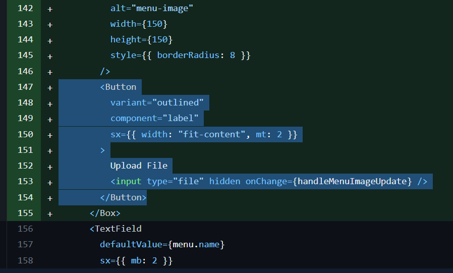
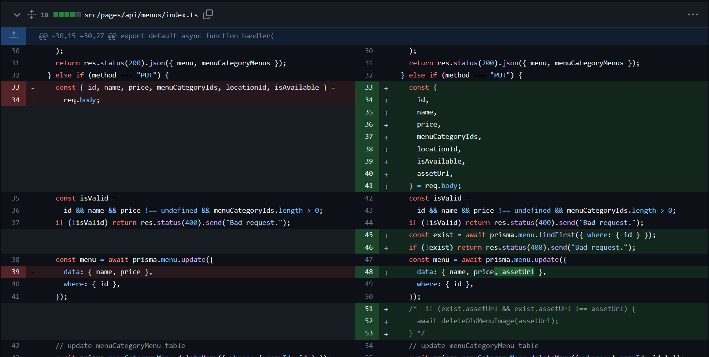

## MSquare Programming Fullstack Course

### Batch 2

### Episode-_42_ Summary

##

### 1. Update Menu Image (backoffice)

### 2. Create Order (order app)

### 3. Review orders (order app)

##

### 1. Update Menu Image (backoffice)

- menu တွေ ရဲ့ ပုံကို update လုပ်လို့ရအောင် menu edit လုပ်တဲ့ page မှာ input button တစ်ခု ကို ထည့်ပေးလိုက်ပါမယ်



- /backoffice/menus/[id]/index.tsx မှာ menu image ကို ပြတဲ့ အောက်မှာ file input button တစ်ခုကို ထည့်လိုက်ပြီး တစ်ခုခု ထည့်လိုက်တာနဲ့ handleMenuImageUpdate function ကို ခေါ်ပေးလိုက်ပါတယ်

```js
// src/pages/backoffice/menus/[id]/index.tsx -->handleMenuImageUpdate

const handleMenuImageUpdate = async (evt: ChangeEvent<HTMLInputElement>) => {
  const files = evt.target.files;
  if (files) {
    const file = files[0];
    const formData = new FormData();
    formData.append("files", file);
    const response = await fetch(`${config.apiBaseUrl}/assets`, {
      method: "POST",
      body: formData,
    });
    const { assetUrl } = await response.json();
    dispatch(updateMenu({ ...data, assetUrl }));
  }
};
```

- ရွေးလိုက်တဲ့ ပုံကို formData တစ်ခုထဲ ထည့်ပြီး /api/assests route ဆီ request body အဖြစ် ပို့ပေးလိုက်တာဖြစ်ပါတယ်
- api ဘက်မှာတော့ digital ocean space bucket မှာ upload အတွက် ပြင်ဆင်ထားပြီးသားမလို့ upload လုပ်ပြီး url တစ်ခုကို response ပြန်လာမှာဖြစ်ပါတယ်
- ရလာတဲ့ Url ကို updateMenu action ဆီ dispatch လုပ်ပြီး ပို့ပေးလိုက်တာပဲ ဖြစ်ပါတယ်
- /api/menus route မှာလည်း PUT method နဲ့ လက်ခံပြီး update လုပ်တဲ့အချိန်မှာ assetUrl ကိုပါ update လုပ်ပေးလိုက်ရပါမယ်



##

### 2. Create Order (order app)

- ပြီးခဲ့တဲ့ သင်ခန်းစာမှာ order app ကနေ menu တစ်ခုကို ရွေးပြီး cart ထဲ ထည့်တာကိုလေ့လာခဲ့ကြပါတယ်
- ခု cart ထဲမှာ ရှိနေတဲ့ item တွေကို order create လုပ်နိုင်ဖို့ ပြင်ဆင်ပါတယ်
- အရင်ဆုံး database မှာ order tabel နဲ့ orderLine table ဆိုပြီး နှစ်ခု မခွဲတော့ပဲ order table တစ်ခုပဲ လုပ်ပြီး prisma migrate လုပ်ပေးလိုက်ပါမယ်

```js
/prisma/schema.prisma --> model order

model Order {
  id         Int         @id @default(autoincrement())
  menu       Menu        @relation(fields: [menuId], references: [id])
  menuId     Int
  addon      Addon?       @relation(fields: [addonId], references: [id])
  addonId    Int?
  quantity   Int
  orderSeq   String
  status     ORDERSTATUS
  totalPrice Int
  table      Table       @relation(fields: [tableId], references: [id])
  tableId    Int
  isArchived Boolean     @default(false)
  createdAt  DateTime    @default(now())
  updatedAt  DateTime    @updatedAt
}

```

- အရင် ရှိနေတဲ့ order နဲ့ orderLine model တွေကို ဖျက်ပြီး order တစ်ခုပဲ ပြန်ပြီး ထည့်ကာ migrate လုပ်ပေးလိုက်ပါတယ်
- ပြီးရင် order တွေ ရဲ့ state တွေကို ကိုင်တွယ်ဖို့ store ထဲမှာ orderSlice တစ်ခုကိုလည်း ဖန်တီးလိုက်ပါမယ်

```js
// src/store/slices/orderSlice.ts

import { CreateOrderOptions, OrderSlice } from "@/types/order";
import { config } from "@/utils/config";
import { Order } from "@prisma/client";
import { PayloadAction, createAsyncThunk, createSlice } from "@reduxjs/toolkit";

const initialState: OrderSlice = {
  items: [],
  isLoading: false,
  error: null,
};

export const createOrder = createAsyncThunk(
  "order/createOrder",
  async (options: CreateOrderOptions, thunkApi) => {
    const { tableId, cartItems, onSuccess, onError } = options;
    try {
      const response = await fetch(`${config.apiBaseUrl}/orders`, {
        method: "POST",
        headers: { "content-type": "application/json" },
        body: JSON.stringify({ tableId, cartItems }),
      });
      const { orders } = await response.json();
      thunkApi.dispatch(setOrders(orders));
      onSuccess && onSuccess(orders);
    } catch (err) {
      onError && onError();
    }
  }
);

const orderSlice = createSlice({
  name: "order",
  initialState,
  reducers: {
    setOrders: (state, action: PayloadAction<Order[]>) => {
      state.items = [...state.items, ...action.payload];
    },
  },
});

export const { setOrders } = orderSlice.actions;
export default orderSlice.reducer;
```

- orderSlice ထဲမှာ setOrder action တစ်ခုသာ သတ်မှတ်ထားပြီး order တွေ ကို store ထဲ သိမ်းလို့ရအောင် လုပ်ထားပါတယ်
- createOrder thunk တစ်ခုလည်း လုပ်ထားပြီး /api/orders route ကို POST method နဲ့ request လုပ်ကာ ၀င်လာမယ့် payload တွေကို request body အနေနဲ့ ပို့ပေးထားပါတယ်
- order တစ်ခု comfirm လုပ်လိုက်ရင် createOrder thunk ကို disptach လုပ်ပြီး CartItem တွေနဲ့ tableID ကိုပါ payload အနေနဲ့ ထည့်ပေးလိုက်မှာဖြစ်ပါတယ်

```js
// src/pages/order/cart/index.tsx --> confirmOrder function

const confirmOrder = async () => {
  const isValid = tableId;
  if (!isValid) return alert("Table Id");
  dispatch(
    createOrder({
      tableId,
      cartItems,
      onSuccess: (orders: Order[]) => {
        dispatch(emptyCart());
        router.push({
          pathname: `/order/active-order/${orders[0].orderSeq}`,
          query: { tableId },
        });
      },
    })
  );
};
```

- Cart page မှာ Confirm Order button ကို နှိပ်လိုက်ရင် confirmOrder function ကို ခေါ်ပေးမှာဖြစ်ပြီး
- confirmOrder function ထဲမှာတော့ orderSlice ထဲက createOrder thunk ကို dispatch လုပ်ပြီး tableId နဲ့ cartItems ကို ထည့်ပေးလိုက်ပါတယ်
- api မှာ success ဖြစ်ခဲ့ရင်တော့ cart ကို empty လုပ်ပြီး /order/active-order ဆီကို response ပြန်လာတဲ့ orderSeq id နဲ့ dynamic routing လုပ်ပေးလိုက်ပြီး order status ကို ပြပေးမှာဖြစ်ပါတယ်
- active-order route တစ်ခု လုပ်ပေးရမှာဖြစ်ပါတယ်

```js
// src/pages/order/active-order/[id]/index.tsx

import { Box } from "@mui/material";
import { useRouter } from "next/router";

const ActiveOrder = () => {
  const router = useRouter();
  const orderSeq = router.query.id;
  return (
    <Box
      sx={{
        display: "flex",
        justifyContent: "center",
        p: 3,
        bgcolor: "#E8F6EF",
        borderRadius: 15,
        mx: 3,
        position: "relative",
        top: 150,
        zIndex: 5,
      }}
    >
      OrderSeq: {orderSeq}
    </Box>
  );
};

export default ActiveOrder;
```

- ActiveOrder page မှာတော့ လောလောဆယ် orderSeq id သာပြပေးထားပါတယ်(နောက်သင်ခန်းစာမှာ update လုပ်သွာားမှာဖြစ်ပါတယ်)

##

- frontend ဘက်မှာ order confirm and create လုပ်ဖို့ပြင်ဆင်ထားပြီးပြီမို့ api ဘက်မှာ request ကို လက်ခံပြီး database မှာ order တွေ create လုပ်ပေးပါမယ်
- orderSeq အဖြစ် ramdom & unique ဖြစ်တဲ့ id တွေ ရနိုင်ဖို့ nanoid ဆိုတဲ့ npm package တစ်ခုကို အသုံးပြုပါမယ်

```console
$ npm i nanoid
```

- nanoid ဆိုတာက nanoid() ဆိုပြီး ခေါ်ပေးလိုက်ရုံနဲ့ ramdom & unique ဖြစ်တဲ့ id ကို ထုတ်ပေးမှာဖြစ်ပါတယ်
- /api/orders route မှာ request တွေကို လက်ခံလိုက်ပါမယ်

```js
// src/pages/api/orders/index.ts

// Next.js API route support: https://nextjs.org/docs/api-routes/introduction
import { CartItem } from "@/types/cart";
import { prisma } from "@/utils/db";
import { getCartTotalPrice } from "@/utils/generals";
import { ORDERSTATUS } from "@prisma/client";
import { nanoid } from "nanoid";
import type { NextApiRequest, NextApiResponse } from "next";

export default async function handler(
  req: NextApiRequest,
  res: NextApiResponse
) {
  const method = req.method;
  if (method === "POST") {
    const { tableId, cartItems } = req.body;
    const isValid = tableId && cartItems.length;
    if (!isValid) return res.status(400).send("Bad request.");
    const orderSeq = nanoid();
    for (const item of cartItems) {
      const cartItem = item as CartItem;
      const hasAddons = cartItem.addons.length > 0;
      if (hasAddons) {
        for (const addon of cartItem.addons) {
          await prisma.order.create({
            data: {
              menuId: cartItem.menu.id,
              addonId: addon.id,
              quantity: cartItem.quantity,
              orderSeq,
              status: ORDERSTATUS.PENDING,
              totalPrice: getCartTotalPrice(cartItems),
              tableId,
            },
          });
        }
      } else {
        await prisma.order.create({
          data: {
            menuId: cartItem.menu.id,
            quantity: cartItem.quantity,
            orderSeq,
            status: ORDERSTATUS.PENDING,
            totalPrice: getCartTotalPrice(cartItems),
            tableId,
          },
        });
      }
    }
    const orders = await prisma.order.findMany({ where: { orderSeq } });
    return res.status(200).json({ orders });
  }
  res.status(405).send("Method not allowed.");
}

```

- လိုအပ်တဲ့ data တွေ validation စစ်လိုက်ပြီး
- nanoid နဲ့ orderSeq id တစ်ခု create လုပ်လိုက်ပါတယ်
- လက်ရှိ order comfirm လုပ်လိုက်တဲ့ cartItemထဲမှာ menu ဘယ်လောက်ပါပါ orderSeq က တစ်ခုပဲ ဖြစ်မှာပါ
- ဘာလို့လဲဆိုတော့ table တစ်ခုထဲကနေ လာတဲ့ order ဖြစ်တာမို့လို့ပါ
- cartitem တစ်ခုချင်းစီအတွက် order table ထဲမှာ row တစ်ခုစီကို crate လုပ်ပေးလိုက်ပါတယ်
- addons တွေ ပါလာခဲ့ရင် addon တစ်ခုချင်းစီအတွက် ပါ row တစ်ခုချင်းစီကို create လုပ်ပေးထားပါတယ်
- cartItem မှာ ပါလာတဲ့ menu က addon နှစ်ခုပါလာခဲ့ရင် အဲ့ဒီ menu အတွက် order table မှာ row က နှစ်ခုထွက်လာမှာဖြစ်ပြီး
- cartItem မှာ ပါလာတဲ့ menu က addon မပါလာခဲ့ရင် အဲ့ဒီ menu အတွက် order table မှာ row က တစ်ခုပဲထွက်လာမှာဖြစ်ပါတယ်
