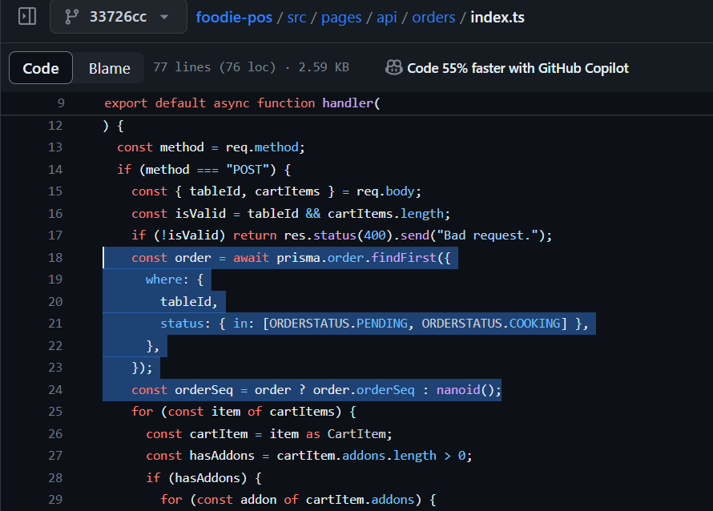
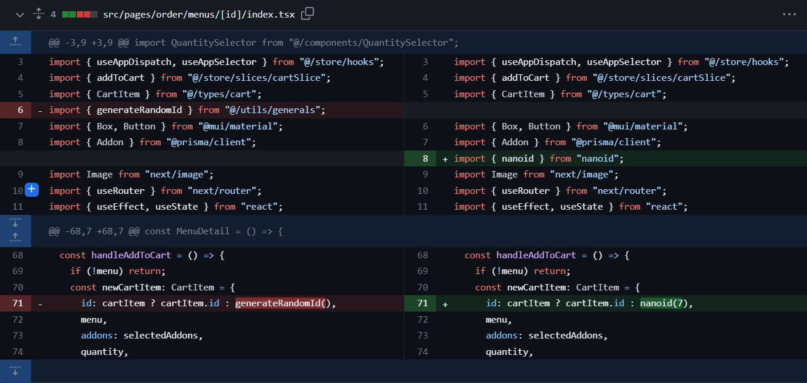
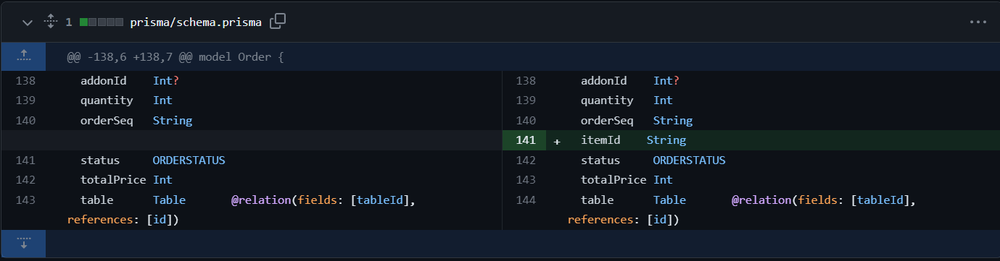
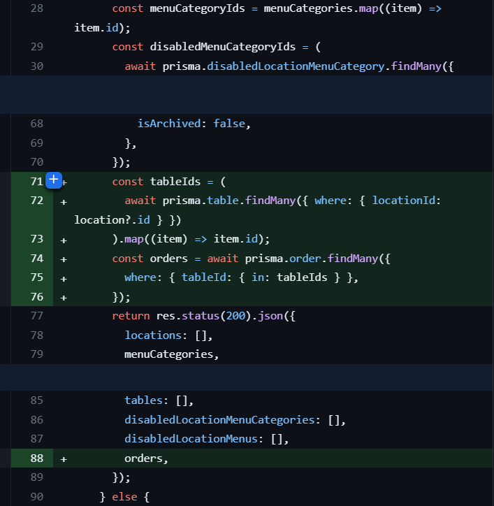
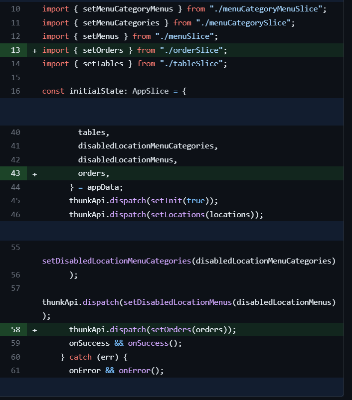

## MSquare Programming Fullstack Course

### Batch 2

### Episode-_43_ Summary

### 1. Check order come from the same table

### 2 . Show active on order app and backoffice app

### 3 . order tracking (order status)

##

### 1. Check order come from the same table

- oreder တစ်ခု ၀င်လာရင် အဲ့ဒီ order လုပ်လာတဲ့ table id နဲ့ order တွေ ရှိပြီးသားလား table အသစ်က လာတာလားဆိုတာကို စစ်ပေးပြီးမှ order seq အသစ် create လုပ်သင့်မသင့်ကို စစ်ပြီး database ထဲကို update လုပ်ပေးရမှာဖြစ်ပါတယ်



- order ၀င်လာတဲ့ table မှာ PENDING or COOKING ဖြစ်တဲ့ order ရှိနေတယ်ဆိုရင် order seq အသစ်မလုပ်တော့ပဲ ရှိပြီးသားကို ပြန်အသုံးပြုလိုက်ပြီးcreate လုပ်ပေးလိုက်တာပဲဖြစ်ပါတယ်
- ဆက်ပြီး menu တူပြီး addon မတူတဲ့ order နှစ်ခုမှာတဲ့အခါ ခွဲခြားလိုကရနိုင်အောင် cart မှာ item id သုံးပေးခဲ့သလို order table ထဲမှာလည်း item id ကိုပါ ထည့်ပေးလိုက်ပါမယ်
- အရင်လို generateId function ကို မသုံးတော့ပဲ nanoid ကို card item id crate လုပ်တဲ့နေရာမှာ ပြောင်းသုံးလိုက်ပါမယ်



- line 71 က generateRndomId နေရာမှာ nanoid ကို ပြောင်းသုံးလိုက်တာပဲဖြစ်ပါတယ်
- order table ထဲမှာလည်း itemId ကို သိမ်းနိုင်ဖို့ order model မှာ column တစ်ခု ထပ်ထည့်ပြီး migrateလုပ်ပေးလိုက်ပါမယ်



##

### Show order in order review page

- active ဖြစ်တဲ့ order တွေကို order app မှာကော backoffice က order page မှာပါ ပြပေးနိုင်ဖို့ order card component တစ်ခုကို create လုပ်လိုက်ပါမယ်။

```js
//src/components/OrderCard.tsx

import { useAppSelector } from "@/store/hooks";
import { OrderItem } from "@/types/order";
import { Box, Card, MenuItem, Select, Typography } from "@mui/material";
import { AddonCategory, ORDERSTATUS } from "@prisma/client";

interface Props {
  orderItem: OrderItem;
  isAdmin: boolean;
  handleOrderStatuUpdate: (itemId: string, status: ORDERSTATUS) => void;
}

const OrderCard = ({ orderItem, isAdmin, handleOrderStatuUpdate }: Props) => {
  const addonCategories = useAppSelector((state) => state.addonCategory.items);

  return (
    <Card
      sx={{
        display: "flex",
        flexDirection: "column",
        justifyContent: "space-between",
        width: 250,
        height: 250,
        py: 1,
        px: 2,
        mt: 2,
        mr: 2,
      }}
    >
      <Box
        sx={{
          height: 250 * 0.15,
          display: "flex",
          justifyContent: "space-between",
          alignItems: "center",
          borderBottom: "1px solid lightgray",
        }}
      >
        <Typography sx={{ fontWeight: "bold" }}>Item Id: </Typography>
        <Typography>{orderItem.itemId}</Typography>
      </Box>
      <Box sx={{ height: 250 * 0.6, overflow: "scroll" }}>
        {orderItem.orderAddons.map((orderAddon) => {
          const addonCategory = addonCategories.find(
            (item) => item.id === orderAddon.addonCategoryId
          ) as AddonCategory;
          return (
            <Box key={addonCategory.id} sx={{ mb: 2 }}>
              <Typography>{addonCategory.name}</Typography>
              {orderAddon.addons.map((addon) => {
                return (
                  <Typography
                    key={addon.id}
                    sx={{
                      fontSize: 14,
                      ml: 2,
                      fontStyle: "italic",
                      fontWeight: "bold",
                    }}
                  >
                    {addon.name}
                  </Typography>
                );
              })}
            </Box>
          );
        })}
      </Box>
      <Box
        sx={{
          height: 250 * 0.15,
          display: "flex",
          justifyContent: "space-between",
          alignItems: "center",
          borderTop: "1px solid lightgray",
          pt: 1,
        }}
      >
        <Typography sx={{ fontWeight: "bold" }}>Status: </Typography>
        {isAdmin ? (
          <>
            <Select
              value={orderItem.status}
              onChange={(evt) =>
                handleOrderStatuUpdate(
                  orderItem.itemId,
                  evt.target.value as ORDERSTATUS
                )
              }
              sx={{ height: 30 }}
            >
              <MenuItem value={ORDERSTATUS.PENDING}>
                {ORDERSTATUS.PENDING}
              </MenuItem>
              <MenuItem value={ORDERSTATUS.COOKING}>
                {ORDERSTATUS.COOKING}
              </MenuItem>
              <MenuItem value={ORDERSTATUS.COMPLETE}>
                {ORDERSTATUS.COMPLETE}
              </MenuItem>
            </Select>
          </>
        ) : (
          <Typography>{orderItem.status}</Typography>
        )}
      </Box>
    </Card>
  );
};

export default OrderCard;
```

- orderItem, isAdmin, handleOrderStatuUpdat စတဲ့ props သုံးခုလက်ခံတဲ့ OrderCard component တစ်ခုကို သတ်မှတ်လိုက်ပြီး order item ထဲက data တွေကို ပြပေးဖို့ လုပ်လိုက်ပါတယ်
- isAdmin ဖြစ်မှ orderStatus တွေကို ပြင်နိင်မယ့် MUI Select ကို လည်း နောက်ဆုံးမှာ ထည့်ပေးထားလိုက်ပါတယ်

- app ထဲကို စ၀င်လာတာနဲ့ ရှိသမျှ order တွေကို fetch ပြီး store ထဲ set လုပ်နိုင်ဖို့ appSlice ထဲမှာ setOrder action ကို dispatch လုပ်ပေးလိုက်ပါမယ်



- /api/app route က data တွေ လှမ်းယူတဲ့နေရာမှာ order တွေကို လည်း table အလိုက် လှမ်းယူလိုက်ပြီး reponse ပြန်ထားပေးလိုက်ပါတယ်



- appSlice ထဲမှာလည်း response ပြန်လာတဲ့ order တွေကို လက်ခံပြီး store ထဲမှာ ထည့်ပေးလိုက်တာပဲ ဖြစ်ပါတယ်

- ခုဆိုရင် store ထဲမှာ order တွေ ရှိနေပြီးမို့ order တွေကို OrderCard ကို သုံးပြီး Order appမှာရော backoffice ကို order page မှာပါပြပေးလိုက်ပါမယ်
- order တွေကို လည်း store ထဲကအတိူင်း ပြပေးမှာ မဟုတ်ပဲ format လုပ်ပြီးမှ ပြပေးမှာ ဖြစ်ပါတယ်

```js
// src/utils/general.ts

export const formatOrders = (orders: Order[], addons: Addon[]): OrderItem[] => {
  const orderItemIds: string[] = [];
  orders.forEach((order) => {
    const itemId = order.itemId;
    const exist = orderItemIds.find((orderItemId) => orderItemId === itemId);
    if (!exist) orderItemIds.push(itemId);
  });
  const orderItems: OrderItem[] = orderItemIds.map((orderItemId) => {
    const currentOrders = orders.filter(
      (order) => order.itemId === orderItemId
    );
    const addonIds = currentOrders.map((item) => item.addonId);
    let orderAddons: OrderAddon[] = [];
    addonIds.forEach((addonId) => {
      const addon = addons.find((item) => item.id === addonId) as Addon;
      const exist = orderAddons.find(
        (item) => item.addonCategoryId === addon.addonCategoryId
      );
      if (exist) {
        orderAddons = orderAddons.map((item) => {
          const isSameParent = item.addonCategoryId === addon.addonCategoryId;
          if (isSameParent) {
            return {
              addonCategoryId: addon.addonCategoryId,
              addons: [...item.addons, addon].sort((a, b) =>
                a.name.localeCompare(b.name)
              ),
            };
          } else {
            return item;
          }
        });
      } else {
        orderAddons = [
          ...orderAddons,
          {
            addonCategoryId: addon.addonCategoryId,
            addons: [addon].sort((a, b) => a.name.localeCompare(b.name)),
          },
        ];
      }
    });

    return {
      itemId: orderItemId,
      status: currentOrders[0].status,
      orderAddons: orderAddons.sort(
        (a, b) => a.addonCategoryId - b.addonCategoryId
      ),
    };
  });
  return orderItems.sort((a, b) => a.itemId.localeCompare(b.itemId));
};
```

```js
//src/pages/order/active-order/[id]/index.tsx

import OrderCard from "@/components/OrderCard";
import { useAppSelector } from "@/store/hooks";
import { formatOrders } from "@/utils/generals";
import { Box } from "@mui/material";
import { useRouter } from "next/router";

const ActiveOrder = () => {
  const router = useRouter();
  const orderSeq = router.query.id;
  const orders = useAppSelector((state) => state.order.items);
  const addons = useAppSelector((state) => state.addon.items);
  const orderItems = formatOrders(orders, addons);
  console.log(orderItems);
  return (
    <Box sx={{ position: "relative", top: 150, zIndex: 5 }}>
      <Box
        sx={{
          display: "flex",
          justifyContent: "center",
          p: 3,
          bgcolor: "#E8F6EF",
          borderRadius: 15,
          mx: 3,
        }}
      >
        OrderSeq: {orderSeq}
      </Box>
      <Box sx={{ display: "flex", flexWrap: "wrap" }}>
        {orderItems.map((orderItem) => {
          return (
            <OrderCard
              key={orderItem.itemId}
              orderItem={orderItem}
              isAdmin={false}
            />
          );
        })}
      </Box>
    </Box>
  );
};

export default ActiveOrder;
```

- order app မှာတော့ order status ကို ပြယုံသာပြပေးထားပြီး isAdmin ကို false အဖြစ် သတ်မှတ်ထားလိုက်ပါတယ်

```js
// src/pages/backoffice/orders/index.tsx

import OrderCard from "@/components/OrderCard";
import { useAppDispatch, useAppSelector } from "@/store/hooks";
import { updateOrder } from "@/store/slices/orderSlice";
import { OrderItem } from "@/types/order";
import { formatOrders } from "@/utils/generals";
import { Box } from "@mui/material";
import { ORDERSTATUS } from "@prisma/client";
import { useEffect, useState } from "react";

const OrdersPage = () => {
  const orders = useAppSelector((state) => state.order.items);
  const addons = useAppSelector((state) => state.addon.items);
  const [orderItems, setOrderItems] = useState<OrderItem[]>([]);
  const dispatch = useAppDispatch();

  const handleOrderStatuUpdate = (itemId: string, status: ORDERSTATUS) => {
    dispatch(updateOrder({ itemId, status }));
  };

  useEffect(() => {
    if (orders.length) {
      setOrderItems(formatOrders(orders, addons));
    }
  }, [orders]);

  return (
    <Box sx={{ display: "flex", flexWrap: "wrap" }}>
      {orderItems.map((orderItem) => {
        return (
          <OrderCard
            key={orderItem.itemId}
            orderItem={orderItem}
            isAdmin
            handleOrderStatuUpdate={handleOrderStatuUpdate}
          />
        );
      })}
    </Box>
  );
};

export default OrdersPage;
```

- backoffice က order page မှာတော့ isAdmin ကို true လုပ်ပေးထားပြီး order status ကို update လုပ်နိုင်အောင် သတ်မှတ်ထားပါတယ်
- order status ကို update လုပ်လိုက်တိုင်း updateOrder ဆိုတဲ့ action ကို dispatch လုပ်ပြီး itemId နဲ့ status ကို ထည့်ပေးထားလိုက်ပါတယ်
- orderSlice မှာ updateOrder ဆိုတဲ့ action ကို သတ်မှတ်ပေးလိုက်ပါမယ်

```js
// store/slices/orderSlice.ts

import {
  CreateOrderOptions,
  OrderSlice,
  UpdateOrderOptions,
} from "@/types/order";
import { config } from "@/utils/config";
import { Order } from "@prisma/client";
import { PayloadAction, createAsyncThunk, createSlice } from "@reduxjs/toolkit";

const initialState: OrderSlice = {
  items: [],
  isLoading: false,
  error: null,
};

export const createOrder = createAsyncThunk(
 ...........
 ...........
);

export const updateOrder = createAsyncThunk(
  "order/updateOrder",
  async (options: UpdateOrderOptions, thunkApi) => {
    const { itemId, status, onSuccess, onError } = options;
    try {
      thunkApi.dispatch(setIsLoading(true));
      const response = await fetch(
        `${config.apiBaseUrl}/orders?itemId=${itemId}`,
        {
          method: "PUT",
          headers: { "content-type": "application/json" },
          body: JSON.stringify({ status }),
        }
      );
      const { orders } = await response.json();
      thunkApi.dispatch(setOrders(orders));
      thunkApi.dispatch(setIsLoading(false));
      onSuccess && onSuccess(orders);
    } catch (err) {
      onError && onError();
    }
  }
);

const orderSlice = createSlice({
  name: "order",
  initialState,
  reducers: {
    setIsLoading: (state, action: PayloadAction<boolean>) => {
      state.isLoading = action.payload;
    },
    setOrders: (state, action: PayloadAction<Order[]>) => {
      state.items = action.payload;
    },
  },
});

export const { setOrders, setIsLoading } = orderSlice.actions;
export default orderSlice.reducer;
```

- payload အနေနဲ့ ၀င်လာတဲ့ itemId နဲ့ status ကို သုံးပြီး /api/orders route ဆီ PUT method နဲ့ request လုပ်ပြီး order status ကို update လုပ်မှာဖြစ်ပါတယ်
- /api/orders route မှာ request ကို လက်ခံပြီး order status ကိ ုupdate လုပ်ပေးမှာ ဖြစ်ပါတယ်

```js
// src/pages/api/orders --> PUT method

  } else if (method === "PUT") {
    const itemId = String(req.query.itemId);
    const isValid = itemId && req.body.status;
    if (!isValid) return res.status(400).send("Bad request");
    const exist = await prisma.order.findFirst({ where: { itemId } });
    if (!exist) return res.status(400).send("Bad request");
    const orderSeq = exist.orderSeq;
    await prisma.order.updateMany({
      data: { status: req.body.status as ORDERSTATUS },
      where: { itemId },
    });
    const orders = await prisma.order.findMany({
      where: { orderSeq, isArchived: false },
      orderBy: { id: "asc" },
    });
    return res.status(200).json({ orders });
  }

```

- order table ထဲမှာ item id ကို သုံးပြီး သူ့ရဲ့ order seq ကို ထုတ်ယူလိုက်ကာ status ကို update လုပ်ပေးလိုက်ပါတယ်
- ပြီးရင်တော့ order seq တူတဲ့ row တွေ အကုန်လုံးကို response ပြန်ပေးထားလိုက်တာဖြစ်ပါတယ်
- response ပြန်လာတဲ့ order rows တွေကို order slice မှာ setOrder ပြန်လုပ်ပေးလိုက်တာမလို့ status update လုပ်ပြီးသား တန်ဖိုးကိုပါ ရလာမှာဖြစ်ပါတယ်
