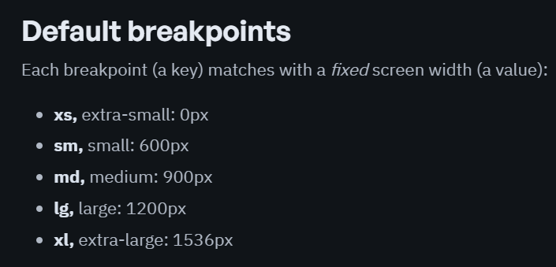
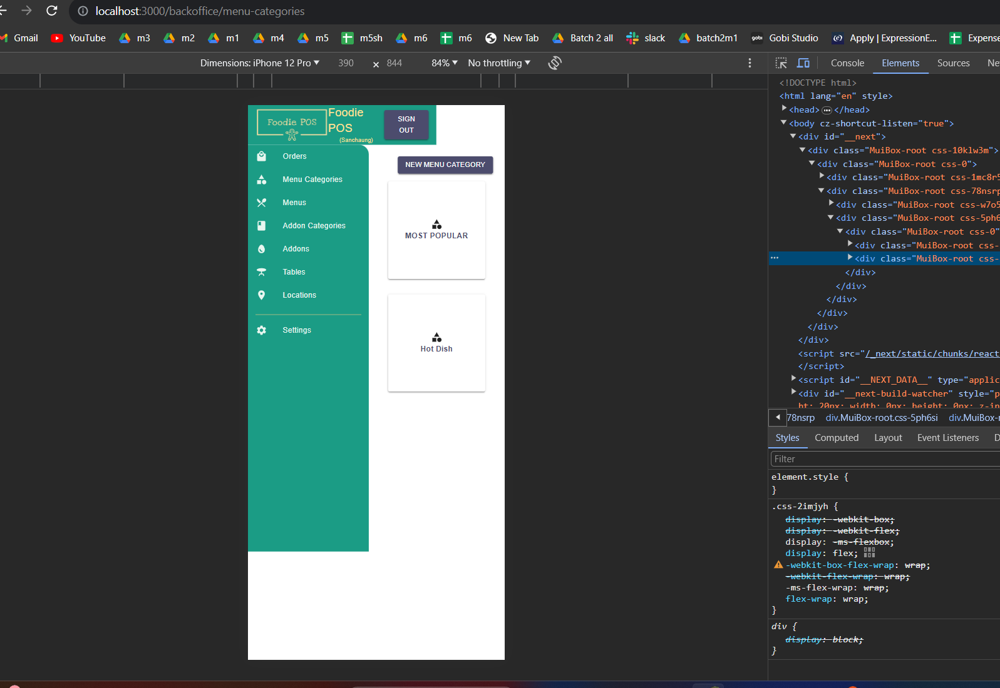
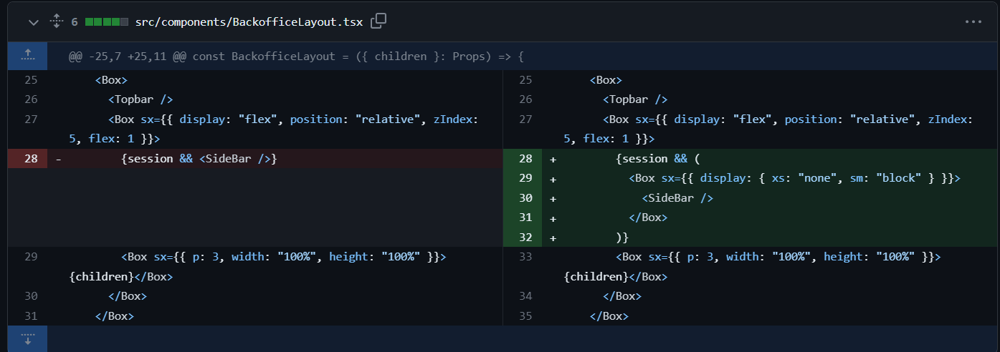
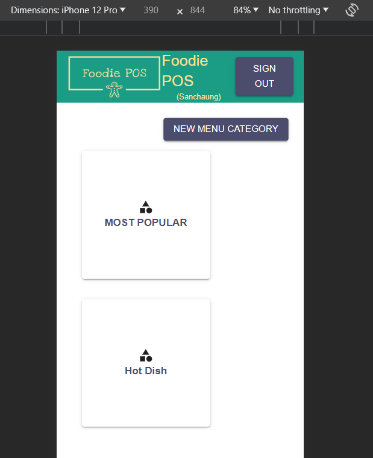
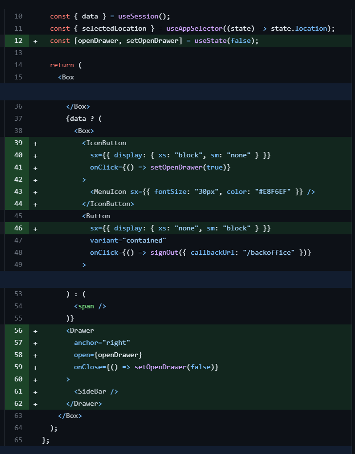
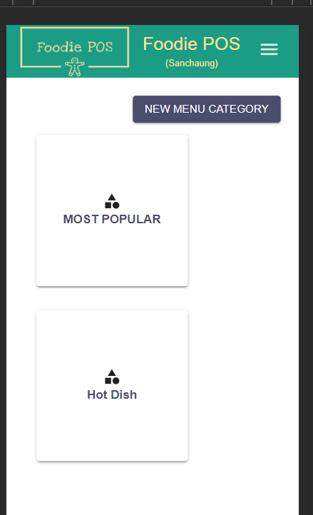
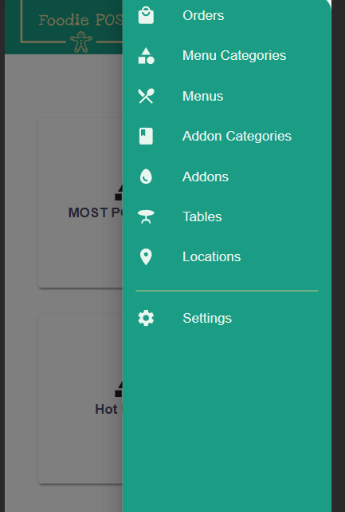

## MSquare Programming Fullstack Course

### Batch 2

### Episode-_45_ Summary

### 1. Responsive for all devices

### 2 . Create landing page for Foodie APP

##

### 1. Responsive for all devices



- MUI မှာ ရှိတဲ့ breakpoints တွေကို သုံးပြီး backoffice app နဲ့ order app တွေကို responsive ဖြစ်အောင် လုပ်ပါမယ်

## xs

- screen size 0 ကနေ 600px ရှိတဲ့ devices တွေမှာ အတွက် breakpoint ဖြစ်ပါတယ်

## sm

- screen size 600px ကနေ 900px ရှိတဲ့ devices တွေမှာ အတွက် breakpoint ဖြစ်ပါတယ်

## md

- screen size 900px ကနေ 1200px ရှိတဲ့ devices တွေမှာ အတွက် breakpoint ဖြစ်ပါတယ်

## lg

- screen size 1200px ကနေ 1536px ရှိတဲ့ devices တွေမှာ အတွက် breakpoint ဖြစ်ပါတယ်

## xl

- screen size 1536px အထက် ရှိတဲ့ devices တွေမှာ အတွက် breakpoint ဖြစ်ပါတယ်

##

### How to use breakpoints

- Breakpoint တွေကို mui component တွေကို style လုပ်တဲ့ `sx={{ }}` ထဲမှာ သုံးပေးရမှာဖြစ်ပါတယ်

### Excample

```js
// syntax
// sx={{ CSS-name :{breakpoint: "css-value"} }}

<Box sx={{ display: { xs: "none", sm: "flex" } }}>Hello</Box>
```

- sx ထဲက css properties တွေရဲ့ value တွေကို object အဖြစ် ပြောင်းလိုက်ပြီး breakpoint တစ်မျိုးမှာ value တစ်မျိုးစီ သတ်မှတ်ပြီး သုံးပေးရမှာဖြစ်ပါတယ်
- နမူနာထဲမှာဆိုရင် size 600px အထက် ရှိတဲ့ devices တွေမှာ Hello ကို ပြပေးမှာဖြစ်ပြီး 600px အောက်ရောက်ရင်တော့ Hello ရဲ့ display ကို none လုပ်ထားတာမလို့ Hello က ပျောက်သွားမှာဖြစ်ပါတယ်
- MUI Breakpoint ကို သုံးပြီး sx ထဲရှိ css properties တွေရဲ့ တန်ဖိုး devices တွေ အလိုက် သတ်မှတ်ပေးထားလိုက်ရင် MUI က Auto တွက်ချက်ပြီး responsive ဖြစ်အောင် ပြပေးမှာဖြစ်ပါတယ်

## making backoffice layout (responsive)

- backoffice layout မှာထည့်ပေးထားတဲ့ sidebar ဟာ လက်ရှိမှာ mobile devices နဲ့ ကြည့်ရင် responsive မဖြစ်ပဲ အဆင်မပြေတာကို ြမင်ရမှာဖြစ်ပါတယ်
  

- အဲ့ဒီ ပြဿနာကို mui breakpoint ကို သုံးပြီး xs နဲ့ sm ကို ကစားပေးလိုက်ပါမယ်



- backoffice layout မှာ sidebar ကို render လုပ်တဲ့နေရာမှာ xs (600px အောက်) ဖြစ်ခဲ့ရင် display ရဲ့ value ကို none အဖြစ် ပေးထားပြီး sm (600px အထက်) ဆိုရင်တော့ ဖြစ်ခဲ့ရင် display ရဲ့ value ကို block အဖြစ် သတ်မှတ်ပေးထားလိုက်တာပဲဖြစ်ပါတယ်
  
- ပြီးရင် menu icon တစ်ခုထည့်ပြီး sidebar ကို ပြန်ပြပေးနိုင်ဖို့ လုပ်လိုက်ပါမယ်



- topbar component မှာ menu icon တစ်ခု ထည့်လိုက်ပြီး xs ဖြစ်မှ display လုပ်မှာဖြစ်ပါတယ်
- ပြီးရင်တော့ mui drawer ကိုသုံးပြီး sidebar ကို ညာဘက်ကနေ ပြပေးအောင် လုပ်လိုက်တာပဲဖြစ်ပါတယ်



