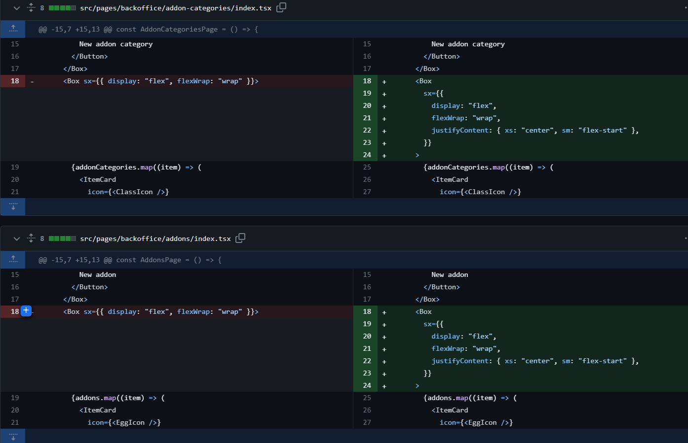
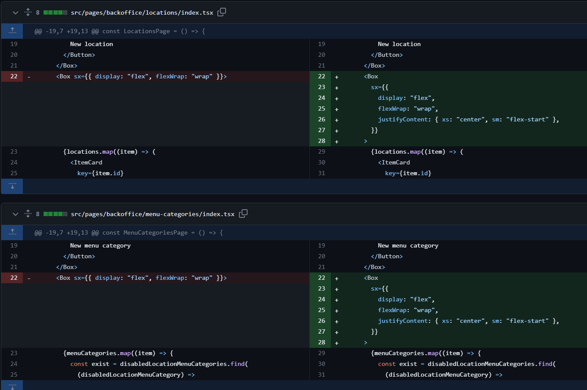
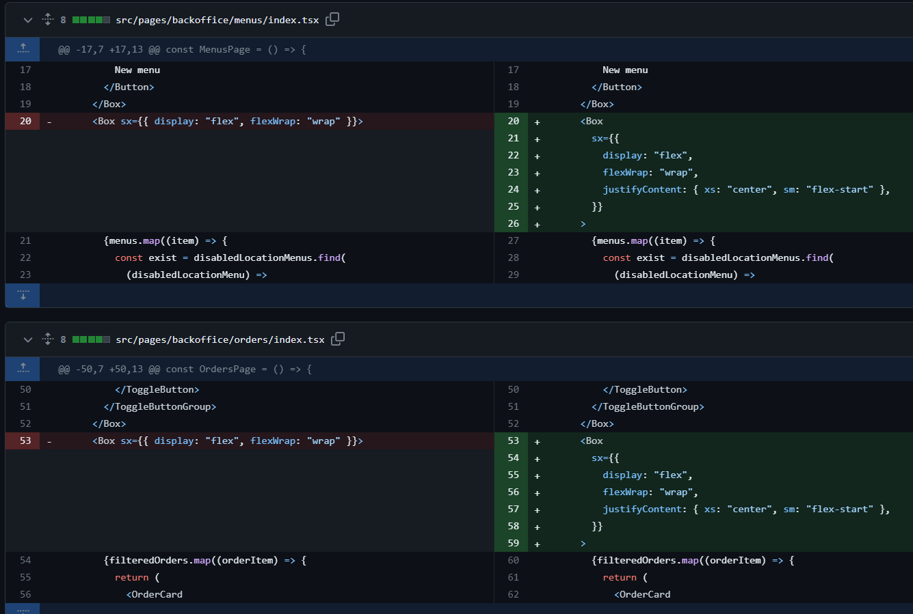
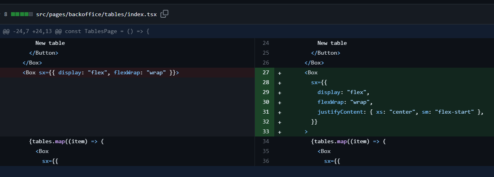
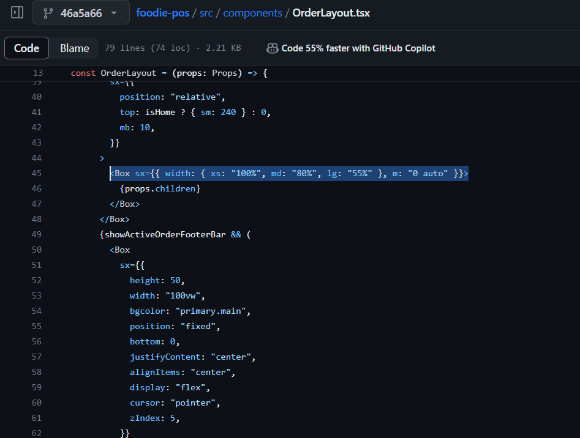
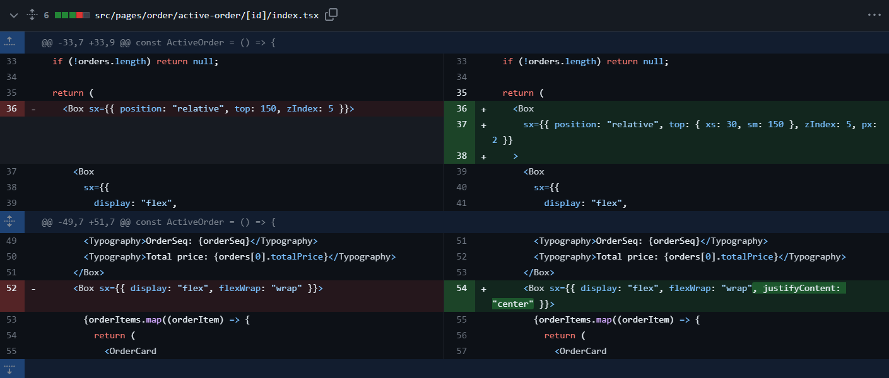
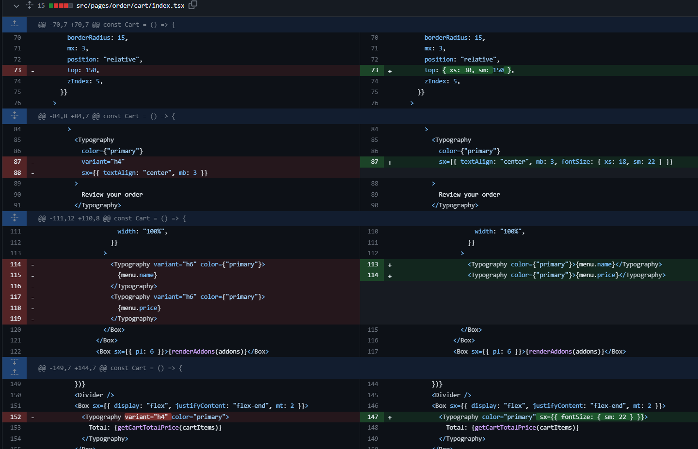
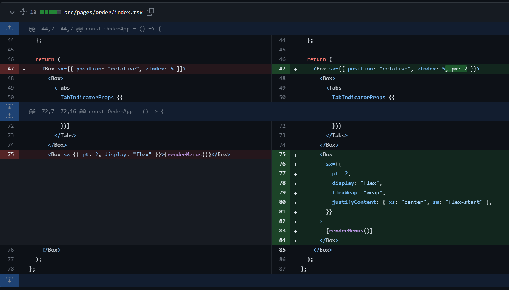
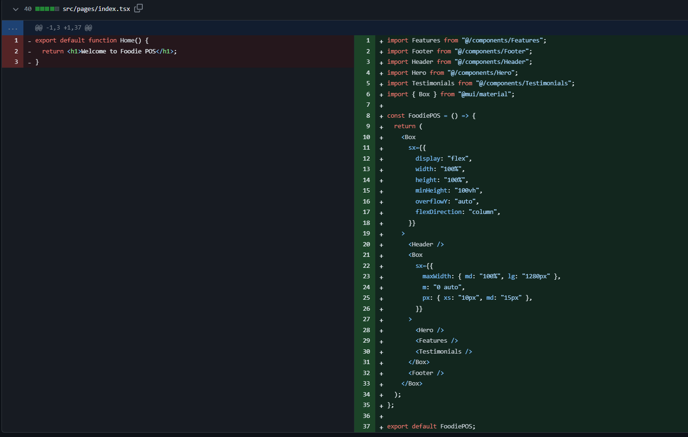
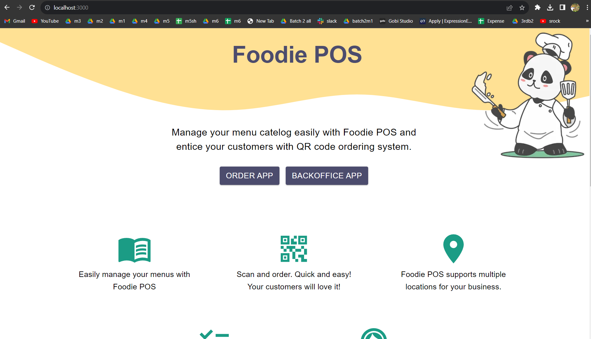

## MSquare Programming Fullstack Course

### Batch 2

### Episode-_45_ Summary

### 1. Responsive for all devices

### 2 . Create landing page for Foodie APP

##

### 1. Responsive for all devices


- MUI မှာ ရှိတဲ့ breakpoints တွေကို သုံးပြီး backoffice app နဲ့ order app တွေကို responsive ဖြစ်အောင် လုပ်ပါမယ်

## xs

- screen size 0 ကနေ 600px ရှိတဲ့ devices တွေမှာ အတွက် breakpoint ဖြစ်ပါတယ်

## sm

- screen size 600px ကနေ 900px ရှိတဲ့ devices တွေမှာ အတွက် breakpoint ဖြစ်ပါတယ်

## md

- screen size 900px ကနေ 1200px ရှိတဲ့ devices တွေမှာ အတွက် breakpoint ဖြစ်ပါတယ်

## lg

- screen size 1200px ကနေ 1536px ရှိတဲ့ devices တွေမှာ အတွက် breakpoint ဖြစ်ပါတယ်

## xl

- screen size 1536px အထက် ရှိတဲ့ devices တွေမှာ အတွက် breakpoint ဖြစ်ပါတယ်

##

### How to use breakpoints

- Breakpoint တွေကို mui component တွေကို style လုပ်တဲ့ `sx={{ }}` ထဲမှာ သုံးပေးရမှာဖြစ်ပါတယ်

### Excample

```js
// syntax
// sx={{ CSS-name :{breakpoint: "css-value"} }}

<Box sx={{ display: { xs: "none", sm: "flex" } }}>Hello</Box>
```

- sx ထဲက css properties တွေရဲ့ value တွေကို object အဖြစ် ပြောင်းလိုက်ပြီး breakpoint တစ်မျိုးမှာ value တစ်မျိုးစီ သတ်မှတ်ပြီး သုံးပေးရမှာဖြစ်ပါတယ်
- နမူနာထဲမှာဆိုရင် size 600px အထက် ရှိတဲ့ devices တွေမှာ Hello ကို ပြပေးမှာဖြစ်ပြီး 600px အောက်ရောက်ရင်တော့ Hello ရဲ့ display ကို none လုပ်ထားတာမလို့ Hello က ပျောက်သွားမှာဖြစ်ပါတယ်
- MUI Breakpoint ကို သုံးပြီး sx ထဲရှိ css properties တွေရဲ့ တန်ဖိုး devices တွေ အလိုက် သတ်မှတ်ပေးထားလိုက်ရင် MUI က Auto တွက်ချက်ပြီး responsive ဖြစ်အောင် ပြပေးမှာဖြစ်ပါတယ်

## making backoffice layout (responsive)

- backoffice layout မှာထည့်ပေးထားတဲ့ sidebar ဟာ လက်ရှိမှာ mobile devices နဲ့ ကြည့်ရင် responsive မဖြစ်ပဲ အဆင်မပြေတာကို ြမင်ရမှာဖြစ်ပါတယ်
  

- အဲ့ဒီ ပြဿနာကို mui breakpoint ကို သုံးပြီး xs နဲ့ sm ကို ကစားပေးလိုက်ပါမယ်


- backoffice layout မှာ sidebar ကို render လုပ်တဲ့နေရာမှာ xs (600px အောက်) ဖြစ်ခဲ့ရင် display ရဲ့ value ကို none အဖြစ် ပေးထားပြီး sm (600px အထက်) ဆိုရင်တော့ ဖြစ်ခဲ့ရင် display ရဲ့ value ကို block အဖြစ် သတ်မှတ်ပေးထားလိုက်တာပဲဖြစ်ပါတယ်
  
- ပြီးရင် menu icon တစ်ခုထည့်ပြီး sidebar ကို ပြန်ပြပေးနိုင်ဖို့ လုပ်လိုက်ပါမယ်


- topbar component မှာ menu icon တစ်ခု ထည့်လိုက်ပြီး xs ဖြစ်မှ display လုပ်မှာဖြစ်ပါတယ်
- ပြီးရင်တော့ mui drawer ကိုသုံးပြီး sidebar ကို ညာဘက်ကနေ ပြပေးအောင် လုပ်လိုက်တာပဲဖြစ်ပါတယ်


- backoffice ထဲမှာရှိတဲ့ ကျန်တဲ့ page တွေမှာလည်း responsive ဖြစ်အောင် လုပ်ပေးလိုက်ပါမယ်






##

### Making responsive (order app)

- order app မှာ responsive ဖြစ်ဖို့ orderLayout ကို ပြင်ပေးလိုက်ပါမယ်



- order header မှာ လည်း breakpoint တွေကို သုံးပေးလိုက်ပါမယ်
-

```js
// src/components/OrderHeader.tsx

import { useAppSelector } from "@/store/hooks";
import Home from "@mui/icons-material/Home";
import ShoppingCartCheckoutIcon from "@mui/icons-material/ShoppingCartCheckout";
import { Box, Typography } from "@mui/material";
import Image from "next/image";
import { useRouter } from "next/router";
import React from "react";

interface Props {
  cartItemCount: number;
}

const OrderAppHeader = ({ cartItemCount }: Props) => {
  const router = useRouter();
  const isHome = router.pathname === "/order";
  const isCart = router.pathname === "/order/cart";
  const isActiveOrder = router.pathname.includes("/order/active-order");
  const isCartOrActiveOrderPage = isCart || isActiveOrder;
  const company = useAppSelector((state) => state.company.item);

  return (
    <Box>
      <Box
        sx={{
          bgcolor: "#1B9C85",
          height: 60,
          px: 2,
          display: { xs: "flex", sm: "none" },
          justifyContent: "space-between",
          alignItems: "center",
        }}
      >
        <Typography
          variant="h5"
          sx={{
            fontWeight: "bold",
            color: "info.main",
          }}
        >
          {company?.name}
        </Typography>
        <Box sx={{ position: "relative" }}>
          {isCartOrActiveOrderPage ? (
            <Home
              onClick={() =>
                router.push({
                  pathname: "/order",
                  query: { tableId: router.query.tableId },
                })
              }
              sx={{
                fontSize: "40px",
                color: "#FFE194",
              }}
            />
          ) : (
            <>
              <ShoppingCartCheckoutIcon
                onClick={() =>
                  router.push({ pathname: "/order/cart", query: router.query })
                }
                sx={{
                  fontSize: "40px",
                  color: "#FFE194",
                }}
              />
              {cartItemCount > 0 && (
                <Typography
                  sx={{
                    textAlign: "right",
                    color: "#E8F6EF",
                    position: "absolute",
                    top: -10,
                    right: -10,
                  }}
                >
                  {cartItemCount}
                </Typography>
              )}
            </>
          )}
        </Box>
      </Box>
      <Box
        sx={{
          width: "100vw",
          display: { xs: "none", sm: "flex" },
          flexDirection: "column",
          alignItems: "center",
          position: "fixed",
          zIndex: 5,
          top: 0,
        }}
      >
        <Box
          sx={{
            position: "absolute",
            top: 10,
            right: { xs: 40, md: 80, lg: 200 },
            cursor: "pointer",
          }}
        >
          {isCartOrActiveOrderPage ? (
            <Home
              onClick={() =>
                router.push({
                  pathname: "/order",
                  query: { tableId: router.query.tableId },
                })
              }
              sx={{
                fontSize: "40px",
                color: "#FFE194",
              }}
            />
          ) : (
            <>
              <ShoppingCartCheckoutIcon
                onClick={() =>
                  router.push({ pathname: "/order/cart", query: router.query })
                }
                sx={{
                  fontSize: "40px",
                  color: "#FFE194",
                }}
              />
              {cartItemCount > 0 && (
                <Typography
                  variant="h5"
                  sx={{
                    textAlign: "right",
                    color: "#E8F6EF",
                    position: "absolute",
                    top: -10,
                    right: -10,
                  }}
                >
                  {cartItemCount}
                </Typography>
              )}
            </>
          )}
        </Box>

        <Image
          src="/order-app-header.svg"
          width={0}
          height={0}
          sizes="100vw"
          style={{ width: "100%", height: "auto" }}
          alt="header-image"
        />
        {isHome && (
          <Box sx={{ position: "absolute" }}>
            <Box sx={{ textAlign: "center" }}>
              <Typography
                variant="h3"
                sx={{
                  fontWeight: "bold",
                  color: "#4C4C6D",
                  mt: 15,
                }}
              >
                {company?.name}
              </Typography>
              <Typography
                variant="body1"
                sx={{ fontStyle: "italic", lineHeight: 1.2 }}
              >
                {company?.street}
                <br /> {company?.township}, {company?.city}
              </Typography>
            </Box>
          </Box>
        )}
      </Box>
    </Box>
  );
};

export default React.memo(OrderAppHeader);
```

- ပြီးရင် order app မှာရှိတဲ့ page တွေမှာလည်း breakpoint နဲ့ responsive ဖြစ်အောင် လုပ်ပေးလိုက်ပါမယ်





##

### Foodie App Landing-page

- website ထဲကို ရောက်လာတာနဲ့ မြင်ရမယ့် page မှာ app အကြောင်းကို ပြပေးမယ့် landing page တစ်ခုကို လုပ်ပေးလိုက်ပါမယ်



```js
import Features from "@/components/Features";
import Footer from "@/components/Footer";
import Header from "@/components/Header";
import Hero from "@/components/Hero";
import Testimonials from "@/components/Testimonials";
import { Box } from "@mui/material";

const FoodiePOS = () => {
  return (
    <Box
      sx={{
        display: "flex",
        width: "100%",
        height: "100%",
        minHeight: "100vh",
        overflowY: "auto",
        flexDirection: "column",
      }}
    >
      <Header />
      <Box
        sx={{
          maxWidth: { md: "100%", lg: "1280px" },
          m: "0 auto",
          px: { xs: "10px", md: "15px" },
        }}
      >
        <Hero />
        <Features />
        <Testimonials />
      </Box>
      <Footer />
    </Box>
  );
};

export default FoodiePOS;
```

- အရင်က welcome to foodie pos ပဲ ပြပေးထားတဲ့ index.tsx မှာ Header / Hero / Features / Testimonials / Footer စတဲ့ component တွေ ကို render လုပ်ပေးလိုက်ပါတယ်
- Header / Hero / Features / Testimonials / Footer စတဲ့ component တွေ သတ်မှတ်ပေးလိုက်ပါမယ်

```js
// src/components/Header.tsx

import { Box, Slide, Typography } from "@mui/material";
import Image from "next/image";

const Header = () => {
  return (
    <Box
      sx={{
        width: "100vw",
        display: "flex",
        flexDirection: "column",
        alignItems: "center",
        minHeight: 300,
        position: "fixed",
        top: 0,
        zIndex: 5,
      }}
    >
      <Image
        src="/header.svg"
        alt="header-image"
        width={0}
        height={0}
        sizes="100vw"
        style={{ width: "100%", height: "auto" }}
      />
      <Slide
        direction="left"
        in={true}
        mountOnEnter
        unmountOnExit
        timeout={1000}
      >
        <Box
          sx={{
            position: "absolute",
            right: 0,
            display: { xs: "none", md: "block" },
          }}
        >
          <Image
            src={"/panda-cooking.png"}
            alt="header-image"
            width={350}
            height={350}
          />
        </Box>
      </Slide>
      <Typography
        variant="h2"
        sx={{
          position: "absolute",
          fontWeight: "bold",
          color: "#4C4C6D",
          mt: 4,
        }}
      >
        Foodie POS
      </Typography>
    </Box>
  );
};

export default Header;
```

```js
// src/components/Hero.tsx

import { Box, Button, Slide, Typography } from "@mui/material";
import Link from "next/link";
import { useRouter } from "next/router";

const Hero = () => {
  const router = useRouter();
  return (
    <Box
      sx={{
        mt: "250px",
        textAlign: "center",
        display: "flex",
        flexDirection: "column",
        alignItems: "center",
      }}
    >
      <Slide
        direction="down"
        in={true}
        mountOnEnter
        unmountOnExit
        timeout={1000}
      >
        <Box>
          <Typography
            sx={{
              maxWidth: 700,
              mb: 4,
              fontSize: { xs: "16px", md: "25px" },
            }}
          >
            Manage your menu catelog easily with Foodie POS and entice your
            customers with QR code ordering system.
          </Typography>
          <Box
            sx={{
              display: "flex",
              justifyContent: "center",
              position: "relative",
            }}
          >
            <Link href={`/order?tableId=1`}>
              <Button
                variant="contained"
                sx={{
                  fontSize: { xs: "16px", md: "20px" },
                  mr: 2,
                  width: "fit-content",
                  backgroundColor: "#4C4C6D",
                }}
              >
                Order App
              </Button>
            </Link>
            <Link href={`/backoffice`}>
              <Button
                variant="contained"
                sx={{
                  fontSize: { xs: "16px", md: "20px" },
                  width: "fit-content",
                  backgroundColor: "#4C4C6D",
                }}
              >
                Backoffice App
              </Button>
            </Link>
          </Box>
        </Box>
      </Slide>
    </Box>
  );
};

export default Hero;
```

```js
// src/components/Features.tsx

import ChecklistIcon from "@mui/icons-material/Checklist";
import LocationOn from "@mui/icons-material/LocationOn";
import MenuBookIcon from "@mui/icons-material/MenuBook";
import QrCode2Icon from "@mui/icons-material/QrCode2";
import SupportAgentIcon from "@mui/icons-material/SupportAgent";
import { Box, Typography, Zoom } from "@mui/material";

const features = [
  {
    icon: <MenuBookIcon sx={{ fontSize: "90px", color: "#1B9C85" }} />,
    text: "Easily manage your menus with Foodie POS",
    delay: "1000ms",
  },
  {
    icon: <QrCode2Icon sx={{ fontSize: "90px", color: "#1B9C85" }} />,
    text: "Scan and order. Quick and easy! Your customers will love it!",
    delay: "1300ms",
  },
  {
    icon: <LocationOn sx={{ fontSize: "90px", color: "#1B9C85" }} />,
    text: "Foodie POS supports multiple locations for your business.",
    delay: "1500ms",
  },
  {
    icon: <ChecklistIcon sx={{ fontSize: "90px", color: "#1B9C85" }} />,
    text: "Backoffice and order apps are included in every subscription.",
    delay: "1700ms",
  },
  {
    icon: <SupportAgentIcon sx={{ fontSize: "90px", color: "#1B9C85" }} />,
    text: "Dedicated customer support so that we are awlays here to help you.",
    delay: "2000ms",
  },
];

const Features = () => {
  return (
    <Box
      sx={{
        display: "flex",
        mt: 15,
        flexWrap: "wrap",
        justifyContent: "center",
      }}
    >
      {features.map((item) => {
        return (
          <Zoom
            key={item.text}
            in={true}
            style={{
              transitionDelay: true ? item.delay : "0ms",
              transitionDuration: "1000ms",
            }}
          >
            <Box sx={{ textAlign: "center", maxWidth: 330, mb: 10, px: 5 }}>
              {item.icon}

              <Typography variant="h6">{item.text}</Typography>
            </Box>
          </Zoom>
        );
      })}
    </Box>
  );
};

export default Features;
```

```js
// src/components/Footer.tsx

import { Box, Typography } from "@mui/material";
import Image from "next/image";
import Link from "next/link";

const Footer = () => {
  return (
    <Box
      sx={{
        height: 150,
        bgcolor: "#4C4C6D",
        px: "12px",
      }}
    >
      <Box
        sx={{
          maxWidth: 1280,
          m: "0 auto",
          display: "flex",
          height: "100%",
          alignItems: "center",
        }}
      >
        <Box
          sx={{
            display: "flex",
            justifyContent: "space-between",
            width: "100%",
            alignItems: "center",
            flexWrap: "wrap",
          }}
        >
          <Box>
            <Typography sx={{ color: "#E8F6EF", fontStyle: "italic" }}>
              Hintada Street 39 <br />
              Sanchaung, Yangon <br />
              contact@foodiepos.com
              <br />
              +95 123 456 79
            </Typography>
          </Box>
          <Image alt="logo" src={"/logo.png"} width={150} height={80} />
          <Box>
            <Link href={"/order?tableId=1"} style={{ textDecoration: "none" }}>
              <Typography sx={{ color: "#E8F6EF", fontStyle: "italic" }}>
                Order app
              </Typography>
            </Link>
            <Link href={"/backoffice"} style={{ textDecoration: "none" }}>
              <Typography sx={{ color: "#E8F6EF", fontStyle: "italic" }}>
                Backoffice
              </Typography>
            </Link>
          </Box>
        </Box>
      </Box>
    </Box>
  );
};

export default Footer;
```


