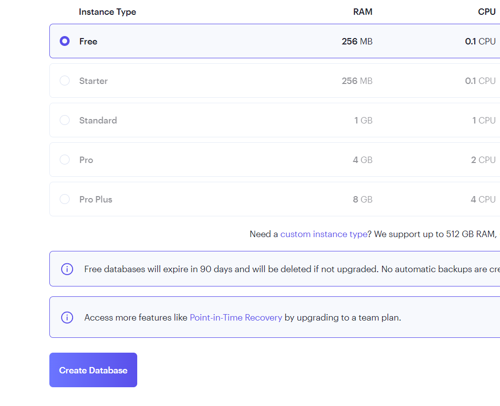
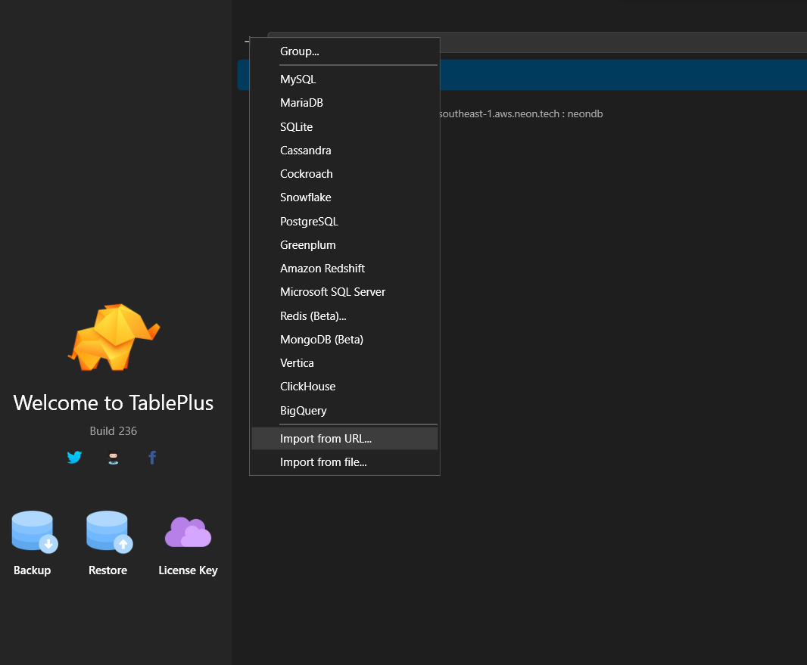

## MSquare Programming Fullstack Course

### Batch 2

### Episode-_45_ Summary

### 1. Deploy local project to vercel

##

### ဒီနေ့သင်ခန်းစာမှာတော့ local မှာ ရှိနေတဲ့ project ကို vercel မှာ deploy လုပ်ပြီး live production ဖြစ်အောင် ပြုလုပ်နည်းကိုလေ့လာသွားကြပါမယ်

- အရင်ဆုံး local မှာ ရှိနေတဲ့ project ကို build လုပ်ကြည့်ပြီး error ရှိမရှိ စစ်ကြည့်ရပါမယ်
- vercel ကို deploy လုပ်တဲ့အခါ next build script ကိုပဲ run ပြီး deploy လုပ်ပေးတာမလို့ local မှာ build စမ်းလို့ အဆင်ပြေမှသာ deploy လုပ်တဲ့အခါ error မတက်မှာဖြစ်ပါတယ်

```properties
$ npm run build
```


- warning တွေကို ဒီနေရာမှာ ignore လုပ်ထားလို့ရပါတယ်
- ဒါပေမယ့် error ရှိခဲ့ရင်တော့ error တွေ အကုန် fix ပြီးမှသာ build နောက်တစ်ခါ ထပ်ပြီး စမ်းပေးရမှာ ဖြစ်ပါတယ်
- ခု ပုံထဲမှာ error တက်နေပါတယ်, error ကို ေသချာဖတ်ကြည့်ပြီး fix ပေးရပါမယ်
- ပုံထဲက error ကတော့ table page မှာ table တွေ loop လုပ်ပြီး ပြတဲ့အချိန်မှာ key prop ကျန်ခဲ့လို့ဖြစ်ပါတယ်
- အဲ့တာကို fix လုပ်ပြီးနောက်တစ်ခါ build ကြည့်ပါမယ်


- ဒီလိုပြလာပြီးဆိုရင်တော့ build လုပ်တာ အဆင်ပြေပြီး ဖြစ်ပါတယ်

##

### Create database on render

- [render.com](https://render.com/) မှာ acc တစ်ခု create လုပ်ပြီး postgresql ကို ရွေးလိုက်ပါ




- လိုအပ်တဲ့ အချက်အလက်တွေ ဖြည့်ပြီးရင် create database လုပ်လိုက်ပါ
- အချိန် ခန စောင့်ပေးရပါမယ်
- 

- status မှာ avialable ဖြစ်ပြီးဆိုရင် scroll လုပ်ပြီး external database url ကို copy လုပ်ထားလိုက်ပါ


##

### connect render database with TablePlus

- tableplus မှာ connection အသစ်လုပ်ပြီး render နဲ့ ချိတ်ဆက်လိုက်ပါမယ်



- `+` ကို နှိပ်ပြီး import from url ကို ရွေးလိုက်ပြီး import လုပ်လိုက်ပါ


- Test လုပ်ကြည့်လို့ အဆင်ပြေပြီး ဆိုရင် connmect လုပ်ပေးလိုက်ပါ

- database ထဲကို ရောက်သွားမှာဖြစ်ပြီး လောလောဆယ်တော့ table တွေ မရှိသေးတာကို ြမင်ရမှာ ဖြစ်ပါတယ်

##

### Update script in package.json

- vercel မှာ deploy လုပ်တဲ့အခါ prisma နဲ့ ချိတ်ဆက်ပြီး အလုပ်လုပ်နိုင်ဖို့ build script ကို update လုပ်ပေးရမှာဖြစ်ပါတယ်

```js
// package.json --> script
"scripts": {
    "dev": "next dev",
    "build": "npx prisma migrate deploy && npx prisma generate && next build",
    "start": "next start",
    "lint": "next lint"
  },
```

- build script ကို run လိုက်ရင် prisma migration နဲ့ generate ကို အရင် လုပ်ပြီးမှ next build ကို run ခိုင်းလိုက်တာပဲဖြစ်ပါတယ်
- local မှာ build လုပ်တာအဆင်ပြေပြီးတော့ script လဲ update လုပ်ပြီးပြီးဆိုရင် git add/ commit လုပ်ပြီး github repo တစ်ခုမှာ တင်ထားလိုက်ပါ

##

### Deploy to vercel

### connect GitHub with vercel

- https://vercel.com/login ကို သွားပါ။
- containue with Github ကိုနှိပ်ပါ
- Authorize Vercel ကို ရွေးပေးပါ


- github repo တွေ ပုံထဲကလို့ မပြပဲ install ပြနေပါက install ကို နှိပ်ပြီး vercel ကို github နဲ့ install လုပ်ပေးရမှာဖြစ်ပါတယ်
- ပြီးရင်တော့ ခုနက တင်ထားတဲ့ repo ကို ရွေးပေးလိုက်ပါ


- Environment Variables ကိုနှိပ်ပြီး key မှာ DATABSE_URL လို့ ရေးပြီး VALUE မှာတော့ render database က external url ကို ထည့်ပေးရပါမယ်
- ပြီးရင်တော့ deploy လုပ်ပေးလိုက်ပါ


- လိုအပ်တာတွေက vercel က auto install လုပ်ပြီး databse နဲ့ ချိတ်ဆက်ကာ build လုပ်ပေးမှာဖြစ်ပါတယ်


- ဒီလိုပြလာရင်တော့ deploy လုပ်တာအောင်မြင်ပါပြီး
- dashboard ကို သွားလိုက်ပါ


- Domains တစ်ခု ထုတ်ပေးထားပါတယ်.
- အဲ့ဒီdomain က project ရဲ့ live website ဖြစ်ပါတယ်


- database မှာလည်း table တွေ ရောက်လာတာကို မြင်ရမှာ ဖြစ်ပါတယ်


##

## Add Production Environment Variables

### Create new credentail on google

- Production မှာ သုံးဖို့ google credentail အသစ်တစ်ခု လုပ်ပေးလိုက်ပါမယ်
- Authorized redirect URIs မှာတော့ vercel domain နဲ့ ထည့်ပေးရမှာဖြစ်ပါတယ်

```
https://{YOUR_DOMAIN}/api/auth/callback/google
```


- create လုပ်ပြီး ရလာတဲ့ id နဲ့ secret key တွေကို သိမ်းထားပါ
- vercel --> project --> setting ထဲကို သွားပြီး Environment Variables ထဲကို ၀င်ပါ
  
- ပြီးရင် .env ဖိုင်ထဲရှိတဲ့ variable တွေ အတိုင်း vercel Environment Key အဖြစ် ထည့်ပေးရမှာဖြစ်ပြီး value တွေကိုတော့ localhost:3000 နေရာမှာ မိမိ vercel domain နဲ့ အစားထိုးပေးရမှာဖြစ်ပါတယ်
- google client id နဲ့ key တွေကိုလည်း ခုနက create လုပ်ထားတဲ့ key တွေနဲ့ အစားထိုးပေးလိုက်ရပါမယ်

```js


GOOGLE_CLIENT_ID = 'your new key'
GOOGLE_CLIENT_SECRET='your new key'

NEXT_PUBLIC_API_BASE_URL= https://kopaung-foodie.vercel.app/api

NEXT_AUTH_URL=https://kopaung-foodie.vercel.app/

NEXTAUTH_SECRET=jFRxhoOEjWY1m4Qc

SPACE_ACCESS_KEY_ID='the same key in local '
SPACE_SECRET_ACCESS_KEY='the same key in local'
SPACE_ENDPOINT=https://sgp1.digitaloceanspaces.com/
```


- ပြီးရင် save ကို နှိပ်ပေးလိုက်ပါ

##

### Update server location

- loading time မြန်စေဖို့ vercel server မှာလည်း singapore region ကို ပြောင်းပေးရပါမယ်
- vercel --> project --> settings --> functions -->choose singapore


- save ပေးလိုက်ပါ

##

## Redeploy

- vercel ရဲ့ setting နဲ့ env တွေကို ပြောင်းလဲလိုက်ပြီး ဆိုရင် deploy တစ်ခါ ပြန်လုပ်ပေးမှ update ဖြစ်လာမှာဖြစ်ပါတယ်
- vercel --> project --> Deployments --> current ဖြစ်နေတဲ့ deploy ကို redeploy လုပ်ပေးရပါမယ်


- Redeploy လုပ်လို့ အောင်မြင်ပြီးဆိုရင် local က project ကို internet မှာ production အဖြစ် deploy လုပ်လို့ ပြီးပါပြီး
