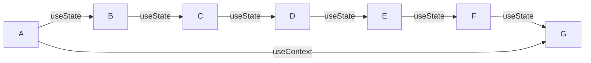
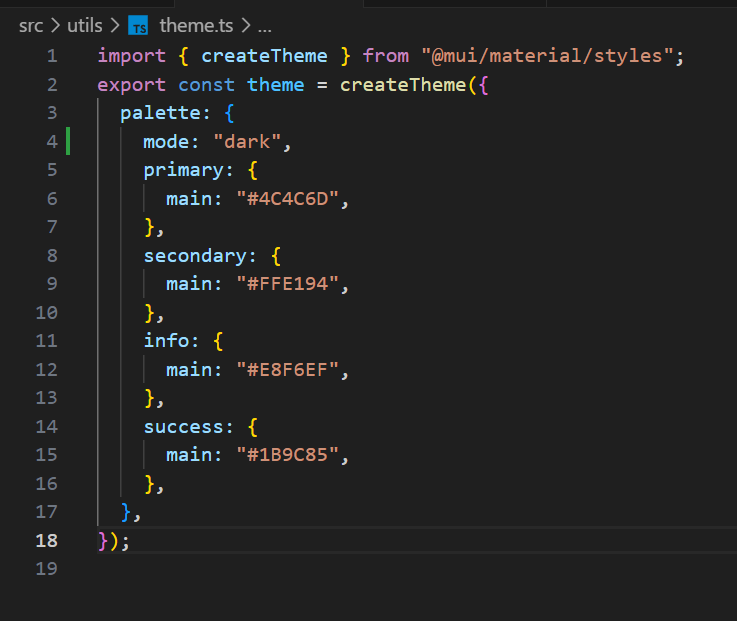
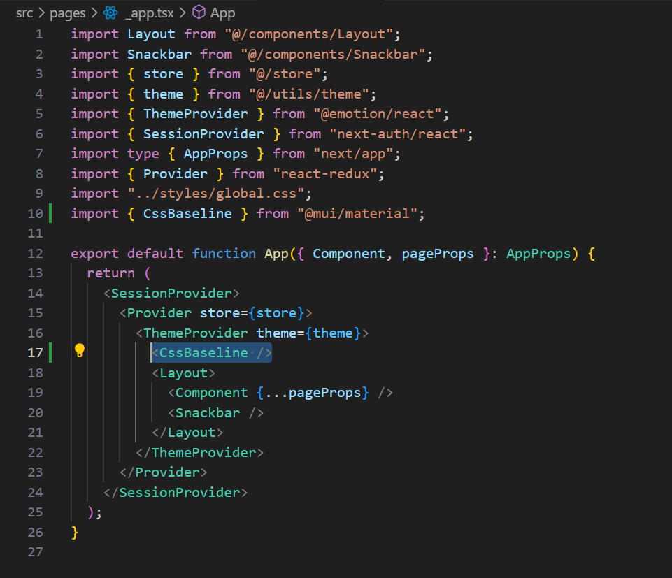
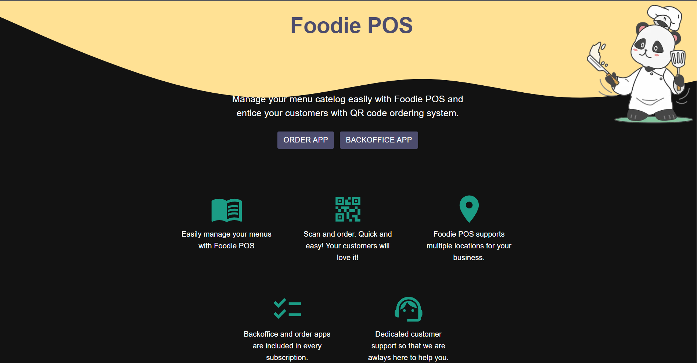
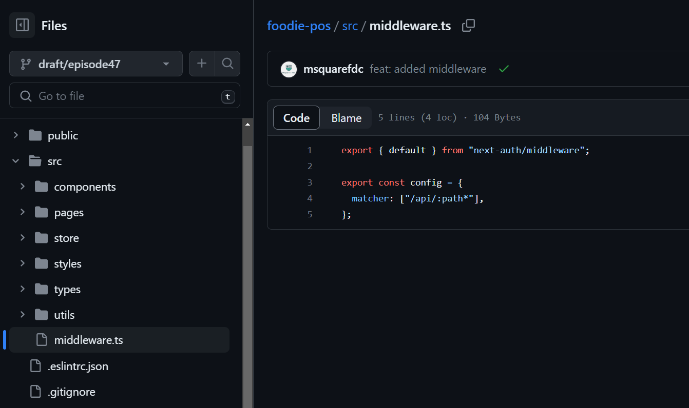

## react context

### State management in react

- အရင် သင်ခန်းစာတွေမှာ state management အနေနဲ့ useState Hook ကို အသုံးပြုခဲ့ကြပါတယ်
- useState ကို အသုံးပြုပြီး props တွေကို parent component ကနေ child component တွေဆီ data တွေပို့ ခဲ့ကြပါတယ်။
- တကယ့်လက်တွေ့ မှာ component တွေ အများကြီး ရှိတဲ့ အခါ main component မှာ state update ဖြစ်တဲ့ အချိန် ရလာမယ့် data ကို ဟိုး..အောက်ဆုံး child component ဆီ ပို့ချင်တဲ့အခါ child component တစ်ဆင့်ချင်းစီ ပို့ပေးရပါတယ်။

### နမူနာ


- A component မှာ state update ဖြစ်ပြီး ရလာမယ့် data ကို G component ကို ပို့ချင်တယ်ဆိုပါစို့
- အဲ့ဒီအချိန်မှာ A component က Data ကို state update ဖြစ်မဖြစ် useState နဲ့ စစ်ပြီး B ဆီ props အနေနဲ့ ပို့ ၊ B component က Data ကို state update ဖြစ်မဖြစ် useState နဲ့ စစ်ပြီး Cဆီ props အနေနဲ့ ပို့ ၊ C component က Data ကို state update ဖြစ်မဖြစ် useState နဲ့ စစ်ပြီး Dဆီ props အနေနဲ့ ပို့ ၊ D component က Data ကို state update ဖြစ်မဖြစ် useState နဲ့ စစ်ပြီး E ဆီ props အနေနဲ့ ပို့ ၊ E component က Data ကို state update ဖြစ်မဖြစ် useState နဲ့ စစ်ပြီး F ဆီ props အနေနဲ့ ပို့ ၊ F component ကနေ မှ G component state update ဖြစ်မဖြစ် useState နဲ့ စစ်ပြီး က ပြန်လက်ခံ စသည်ဖြင့် အဆင့်ဆင့် လုပ်ပေးရပါမယ်
- အထက်ပါ လုပ်ဆောင်ချက် ကို props drilling လို့ ခေါ်ပါတယ်။
- A က data ကို G ကပဲ လိုချင်ပေမယ့် ကြားထဲက မဆိုင်တဲ့ B C D E F တွေကပါ state တွေ update လုပ် ပြီး ပွဲစားအနေနဲ့ ကြားခံ လုပ်ပေးနေရတာကို ဆိုလိုပါတယ်
- props drilling ပြဿနာ ကို **useContext** hook ကို သုံးပြီး ဖြေရှင်းလို့ရပါတယ်



##

### example of Using context hook

- context တစ်ခုကို အသုံးပြုနိုင်ရန် create လုပ်ပေးရပါမယ်
- context create လုပ်တဲ့အခါ default valueကို မဖြစ်မနေထည့်ပေးရပါမယ်

### Syntax

```js
import { createContext } from "react";

const testContext = createContext(default_value);
```

- တကယ့် project တွေလုပ်တဲ့အခါ function တွေ component တွေကို သက်ဆိုင်ရာ folder ထဲမှာ တစ်ခုဆီ ခွဲသိမ်းလေ့ရှိပါတယ်။
- ဥပမာ - type တွေအတွက် သီးသန့်ဖိုင်တစ်ခုခွဲပြီး သိမ်းထာဟတာမျိုး / ROUTE တွေ အတွက် သီးသန့် folder လုပ်ပြီး ခွဲ သိမ်း ထားတာမျိုးကို ဆိုလိုတာပါ
- အခု project ထဲမှာလဲ အဲ့ဒီလို လုပ်ထားလိုက်ပါမယ်
- context အတွက် src အောက်မှာ contexts folder တစ်ခုလုပ်ပါ။

- contexts folder အထဲမှာ PassportAppContext.ts ဖိုင် တစ်ခုလုပ်ပြီး passport app အတွက် context တစ်ခု လုပ်ပါမယ်။

```js
// src/contexts/PassportAppContext.ts

import { createContext } from "react";

const PassportAppContext = createContext < number > 1;

export default PassportAppContext;
```

- react ကနေ createContext ကို import လုပ်ပါတယ်
- PassportAppContext ဆိုတဲ့ context တစ်ခု create လုပ်လိုက်ပြီး default value အနေနဲ့ **1** ကို ထည့်ပေးထားပါတယ်။type ကိုလည်း number အဖြစ် ပေးထားပါတယ်
- ပြီးတော့ အဲ့ဒီ context ကို export လုပ်ထားလိုက်ပါတာမလို့ ဘယ် component ကမဆို import လုပ်ပြီး အသုံးပြုလို့ရပြီး ဖြစ်ပါတယ်

- context ကို useContext နဲ့ အသုံးပြုရပါမယ်။

### syntax

```js
import { useContext } from "react";
const contextValue = useContext(context_name);
```

- အဲ့ဒီ context ကို PassportApp component ထဲမှာ စမ်းသုံးကြည့်ပါမယ်။


- default value အနေနဲ့ ထည့်ပေးလိုက်တဲ့ 1 ကို render လုပ်ပေးတာကို မြင်ရမှာပါ။
- context ရဲ့ default value ကို ပြောင်းကြည့်လိုက်မယ်ဆိုရင် တစ်ချိန်တည်းမှာပဲ state update ဖြစ်ပြီး re-render ပြန်လုပ်ပေးကာ browser မှာ ပြပေးတာကို မြင်ရမှာဖြစ်ပါတယ်။


##

### Set object as context value

- ခု object တစ်ခုကို context value အနေနဲ့ ထားပေးပြီး render လုပ်ကြည့်ပါမယ်။

```js
// PassportAppContext.ts

import { createContext } from "react";

interface User {
  name: string;
  nrcNumber: string;
  dateOfBirth: string;
  phoneNumber: string;
  email: string;
}

interface BookingInfo {
  bookingDate: string;
  time: number;
  user: User;
}

const defaultContext = {
  bookingDate: "08-04-2023",
  time: 10,
  user: {
    name: "aung",
    nrcNumber: "mon223",
    dateOfBirth: "21-05-1990",
    phoneNumber: "09788",
    email: "aung@gmail.com",
  },
};

const PassportAppContext = createContext < BookingInfo > defaultContext;

export default PassportAppContext;
```

- အရင်ဆုံး BookingInfo ဆိုတဲ့ type interface တစ်ခုလုပ်ထားပါတယ်
- defaultContext ဆိုတဲ့ object တစ်ခု လုပ်ထားပြီး အထဲမှာ tpye လုပ်ထားတဲ့ interface နဲ့ ကိုက်ညီတဲ့ dummy data တွေထည့်ပေးထားပါတယ်။
- PassportAppContext ရဲ့ default value အဖြစ် defaultContext ဆိုတဲ့ object ကို ထည့်ပေးထားပြီး type ကို BookingInfo type အဖြစ်ပေးထားလိုက်ပါတယ်။
- ခု PassportApp.tsx မှာ context dataတွေ render လုပ်ကြည့်ပါမယ်


> ရှင်းလင်းချက်

```js
const { bookingDate, time, user } = useContext(PassportAppContext);
```

- useContext နဲ့ PassportAppContext ကို ခေါ်သုံးထားပြီး
- PassportAppContext ရဲ့ default value အနေနဲ့ ပါလာတဲ့ object ကို _destructuring_ လုပ်ပြီး သိမ်းလိုက်ပါတယ်။

```js
<h1>Booking Date : {bookingDate}</h1>

<h1>Booking Time : {time}</h1>

<h1> user: {user.name}</h1>

<h1> Nrc Number: {user.nrcNumber}</h1>

<h1> DOB: {user.dateOfBirth}</h1>

<h1> PH number: {user.phoneNumber}</h1>

<h1> Email: {user.email}</h1>
```

- ဒါကတော့ _destructuring_ လုပ်ထားတဲ့ variable တွေကို သုံးပြီး render လုပ်ထားတာဖြစ်ပါတယ်။

##

### context provider

- ပြီးခဲ့တဲ့ သင်ခန်းစာမှာ context တစ်ခု create လုပ်ပြီး default value ကို ထည့်ပေးထားကာ အခြားcomponent ကနေ useContext နဲ့ အသုံးပြုခဲ့ကြပါတယ်။
- အဲ့ဒီလို အသုံးပြုတဲ့အခါ context ရဲ့ default value ကို ပြောင်းလဲလို့မရပဲ ရှိတဲ့အတိုင်းအသုံးပြုရပါတယ်။
- context ရဲ့ default value ကို state update ဖြစ်တိုင်း ပြောင်းလဲပြီး အသုံးပြုလို့ရအောင် provider နဲ့ အသုံးပြုပေးရပါတယ်
- cnotext ကို အသုံးပြုတဲ့ component ကို context provider နဲ့ wrap လုပ်ပေးရပါမယ်။
- context provider နဲ့ wrap လုပ်ထားတဲ့ မည်သည့်component မဆို context ကို အသုံးပြုတဲ့အခါ ပုံသေပေးထားတဲ့ value ကို dynamic ဖြစ်ဖြစ် အသုံးပြုလို့ ရပါတယ်

##

### Using context provider

- အရင်ဆုံး PassportAppContext **.ts** ကို PassportAppContext **.tsx** အဖြစ် tsxဖိုင်သို့ပြောင်းလိုက်ပါမယ်
- ပြီးတော့ အထဲက default value ကို null အဖြစ် ပြောင်းပြီး type ပြန်လုပ်လိုက်ပါမယ်။

```js
// PassportAppContext.tsx

import { createContext } from "react";

interface User {
  name: string;
  nrcNumber: string;
  dateOfBirth: string;
  phoneNumber: string;
  email: string;
}

interface BookingInfo {
  bookingDate: string | null;
  time: number | null;
  user: User | null;
  updateData: (value: any) => void;
}

const defaultContext = {
  bookingDate: null,
  time: null,
  user: null,
  updateData: () => {},
};

export const PassportAppContext = createContext < BookingInfo > defaultContext;
```

- defaultContext မှာ updateData ဆိုတဲ့ function တစ်ခု ထပ်ထည့်လိုက်ပြီး
- PassportAppContext ကို name export လုပ်ထားလိုက်ပါတယ်။
- ဆက်ပြီး provider တစ်ခု သတ်မှတ်ပါမယ်။

```js
import { createContext, useState } from "react";

interface User {
  name: string;
  nrcNumber: string;
  dateOfBirth: string;
  phoneNumber: string;
  email: string;
}

interface BookingInfo {
  bookingDate: string | null;
  time: number | null;
  user: User | null;
  updateData: (value: any) => void;
}

const defaultContext = {
  bookingDate: null,
  time: null,
  user: null,
  updateData: () => {},
};

export const PassportAppContext = createContext < BookingInfo > defaultContext;

const PassportProvider = ({ children }: any) => {
  const [bookingData, setBookingData] = useState(defaultContext);

  return (
    <PassportAppContext.Provider
      value={{ ...bookingData, updateData: setBookingData }}
    >
      {children}
    </PassportAppContext.Provider>
  );
};

export default PassportProvider;
```

> ရှင်းလင်းချက်

```js
const PassportProvider = ({children} : any) => {...}
```

- PassportProvider ဆိုတဲ့ component တစ်ခု လုပ်လိုက်ပါတယ်
- parameter အနေနဲ့ PassportProvider နဲ့ wrap လုပ်မယ့် ( context ကို အသုံးပြုမယ့်) children component ကို ခေါ်ထားလိုက်ပါတယ်။

```js
const [bookingData, setBookingData] = useState(defaultContext);
```

- bookingData ဆိုတဲ့ state တစ်ခု ကို useState နဲ့ လုပ်ထားပြီး မူလတန်ဖိုးကို defaultContext အဖြစ်ထည်ပေးထားပါတယ်။

```js
return (
  <PassportAppContext.Provider
    value={{ ...bookingData, updateData: setBookingData }}
  >
    {children}
  </PassportAppContext.Provider>
);
```

- parameter( props) အနေနဲ့ လက်ခံထားတဲ့ children component ကို PassportAppContext.Provider နဲ့ wrap လုပ်ပြီး return လုပ်ထားပါတယ်
- PassportAppContext.Provider မှာ value( props) အနေနဲ့ bookingData ဆိုတဲ့ state ရဲ့ တန်ဖိုးကို အရင် copy လုပ်ပြီး ၊ သူ့အထဲက updateData ရဲ့ တန်ဖိုးကို setBookingData အဖြစ် ပြောင်းလဲသတ်မှတ်ပေးလိုက်ပါတယ်။

```js
export default PassportProvider;
```

- ဒါကတော့ PassportProvider ကို default export လုပ်ပေးလိုက်တာပါ။
-
- ခု PassportAppContext ကို အသုံးပြုမယ့် PassportApp.tsx ကို PassportProvider component နဲ့ wrap လုပ်ပေးပါမယ်။
- PassportApp.tsx ကို ခေါ်သုံးပြီး route လုပ်ထားတဲ့ index.tsx မှာ wrap လုပ်ပေးရမှာဖြစ်ပါတယ်။

ppp

- PassportApp.tsx ထဲမှာ context ကို သုံးပြီး datepicker မှာ ရွေးလိုက်တဲ့ ရက်ကို render လုပ်ပါမယ်။

```js
// PassportApp.tsx

import { Box, Button } from "@mui/material";
import { DatePicker, LocalizationProvider } from "@mui/x-date-pickers";
import { AdapterDayjs } from "@mui/x-date-pickers/AdapterDayjs";
import { log } from "console";
import { Dayjs } from "dayjs";
import React, { useContext, useEffect, useState } from "react";
import {PassportAppContext} from"../contexts/PassportAppContext";

const PassportApp = () => {
  const [month, setMonth] = useState<number>();

  useEffect(() => {
    if (month) {
      fetchAvailability();
    }
  }, [month]);

  // fetch to server with query param
  const fetchAvailability = async () => {
    const url = `http://localhost:5000/availability?month=${month}`;
    const response = await fetch(url);
    const data = await response.json();
    console.log(data);
  };

  // use context from contexts
  const { updateData, ...data } = useContext(PassportAppContext);

  return (
    <Box
      sx={{
        mw: "300px",
        display: "flex",
        flexDirection: "column",
        justifyContent: "center",
        p: 2,
        alignItems: "center",
      }}
    >
      <h1>Passport App</h1>
      <Box sx={{ margin: "0 auto", mt: 2, textAlign: "center" }}>
        <LocalizationProvider dateAdapter={AdapterDayjs}>
          <DatePicker
            disablePast
            format="DD/MM/YYYY"
            onChange={(value) => {
              const dayJsObj = value as Dayjs;
              setMonth(dayJsObj.month());
              updateData({
                ...data,
                bookingDate: dayJsObj.format("DD-MM-YYYY"),
              });
            }}
          />
        </LocalizationProvider>
      </Box>

      {/* show selected date */}
      <h1>{data.bookingDate}</h1>

    </Box>
  );
};

export default PassportApp;


```

> ရှင်းလင်းချက်

```js
import React, { useContext, useEffect, useState } from "react";
import { PassportAppContext } from "../contexts/PassportAppContext";
```

- PassportAppContext ကို import လုပ်လိုက်တာဖြစ်ပါတယ်

```js
const { updateData, ...data } = useContext(PassportAppContext);
```

- PassportAppContext ကို useContext နဲ့ သုံးလိုက်ပြီး ရလာတဲ့ object ကို destructure လုပ်ကာ updateData function နဲ့ ကျန် data တွေကို ခွဲ ထုတ်လိုက်ပါတယ်

```js
        <DatePicker
            disablePast
            format="DD/MM/YYYY"
            onChange={(value) => {
              const dayJsObj = value as Dayjs;
              setMonth(dayJsObj.month());
              updateData({
                ...data,
                bookingDate: dayJsObj.format("DD-MM-YYYY"),
              });
            }}
          />
```

- Date picker ထဲက onchange မှာ updateData function ကို ခေါ်လိုက်ပြီး bookingData ရဲ့ state ကို update လုပ်လိုက်တာဖြစ်ပါတယ်။

```js
<h1>{data.bookingDate}</h1>
```

- နောက်ဆုံးမှာတော့ data ထဲက bookingDate ကို h1 tag အနေနဲ့ ပြပေးလိုက်တာဖြစ်ပါတယ်။

##

### အနှစ်ချုပ်

- react မှာ context ကို အသုံးပြုနိုင်ဖို့

  - context ကို default value နဲ့ အရင် create လုပ်ပေးရပါမယ်။

  ```js
  const defaultContext = 1;
  const context1 = createContext(defaultContext);
  ```

  - ပြီးရင် context provider component တစ်ခု create လုပ်ပေးရပါမယ်

  - context provider component ထဲမှာ ပထမ create လုပ်ထားတဲ့ context ရဲ့ default value ကို update လုပ်နိုင်မယ့် useState တစ်ခု လုပ်ပေးပြီး
  - return လုပ်တဲ့အခါ ထို state ရဲ့ တန်ဖိုးကို props အနေနဲ့ ထည့်ပေးရပါမယ်။
  - wrap လုပ်ထားတဲ့ component ကို props အနေနဲ့ လက်ခံပြီး ထို propထဲက children ကို contextProvider နဲ့ wrap ပြီး return လုပ်ပေးရပါမယ်

```js
const contextProvider = ({ children }: any) => {
  const [contextValue, setContextValue] = useState(defaultContext);

  return <context1.Provider value={contextValue}>{children}</context1.Provider>;
};
```

- context ကို ခေါ်သုံးမယ့် component တွေကို context provider component ထဲမှာ wrap လုပ်ပြီးမှ ခေါ်သုံးပေးရမှာ ဖြစ်ပါတယ်

```js
<contextProvider>
  <Children />
</contextProvider>
```

##

### MUI dark/light theme

- MUI မှာ dark/light theme ပြောင်းဖို့အတွက် theme.ts မှာ mode ကိုပြောင်းပေးရမှာဖြစ်ပါတယ်
- 

- ပြီးရင် \_app.tsx မှာ ThemeProvider နဲ့ wrap လုပ်တဲ့နေရာမှာ CssBaseline component ကို လည်းထည့်ပေးလိုက်ရပါမယ်



- ဒါဆိုရင် localhost ကို ၀င်ကြည့်ပါက ခုလို dark theme နဲ့ ပြပေးနေတာကို မြင်ရမှာ ဖြစ်ပါတယ်



- ဒါက MUI ကနေ auto ပါတဲ့ dark mode ကို သုံးပြီး default အတိုင်း color တွေကို မပြင်ပဲ သုံးထားလိုက်ပါတယ်
- theme အလိုက်မိမိ စိတ်ကြိုက်ပြင်ချင်ရင်တော့ theme.ts မှာ ခုလိုသတ်မှတ်ပေးလို့ရပါတယ်

```js
/ src/utils/theme.ts

import { PaletteMode } from "@mui/material";
import { createTheme } from "@mui/material/styles";

const getDesignTokens = (mode: PaletteMode) => ({
  palette: {
    mode,
    ...(mode === "light"
      ? {
          primary: {
            main: "#4C4C6D",
          },
          secondary: {
            main: "#FFE194",
          },
          info: {
            main: "#E8F6EF",
          },
          success: {
            main: "#1B9C85",
          },
        }
      : {
          primary: {
            main: "#e63946",
          },
          secondary: {
            main: "#a8dadc",
          },
          info: {
            main: "#f1faee",
          },
          success: {
            main: "#1d3557",
          },
        }),
  },
});

export const theme = createTheme(getDesignTokens("light"));

```

- getDesignTokens ဆိုတဲ့ function တစ်ခု သတ်မှတ်ထားပါတယ်
- parameter အနေနဲ့ လက်ခံထားတဲ့ mode အပေါ်မူတည်ပြီး palette တွေကို themeနှစ်မျိုးနဲ့ သတ်မှတ်ထားပါတယ်
- နောက်ဆုံးမှာတော့ mui createTheme နဲ့ getDesignTokens ကို သုံးလိုက်တာဖြစ်ပါတယ်
- ထည့်ပေးလိုက်တဲ့ parameter ပေါ်မူတည်ပြီး ပြတဲ့ theme က ကွဲပြားသွားမှာဖြစ်ပါတယ်

### mui CssBaseline component ကို သုံးရင် မိမိသတ်မှတ်ထားတဲ့ css ကို သက်ရောက်မှုရှိလို့ project စစချင်း CssBaseline component ကို အရင် သုံးပြီးမှ စိတ်ကြိုက်CSS ကို သတ်မှတ်ပြီး သုံးပါ

### MUI မှာ palette နဲ့ color တစ်ခုလုပ်လိုက်ရင် mui က အဲ့ဒီ color နဲ့ ပတ်သတ်တဲ့ နောက်ထပ် color သုံးမျိုး (light,dark,contrastText)ကို auto create လုပ်ပေးပါတယ်

- `primary: { main: "#1976d2",}`, ဆိုပြီး သတ်မှတ်လိုက်ရင် ခုလို color တွေပါ သုံးလို့ရနိုင်ပါတယ်

```js
const primary = {
  main: "#1976d2",
  light: "#42a5f5",
  dark: "#1565c0",
  contrastText: "#fff",
};
```

##

### Next Auth middleware

- next auth middleware ကို middleware.ts ဆိုတဲ့ ဖိုင်တစ်ခုမှာ သတ်မှတ်လိုက်ရုံနဲ့ getSession တွေ ဘာတွေ စစ်စရာမလိုတော့ပဲ next auth က auto အလုပ်လုပ်ပေးသွားမှာဖြစ်ပါတယ်
- အရေးကြီးတာက middleware.ts ကို ဖိုင်ထားရမယ့်နေရာနဲ့ ဖိုင်နာမည်ကို အတိအကျ ထားပေးရမှာဖြစ်ပါတယ်



- middleware.ts ဆိုတဲ့ file ကို src folder အောက်မှာ ထားပေးရမှာဖြစ်ပါတယ်
- middleware ထဲမှာတော့ next auth middle ware ကို export လုပ်ပေးလိုက်ရုံနဲ့ ရပါပြီး
- အောက်က config ကတော့ /api အောက်မှာရှိတဲ့ route တွေအကုန်လုံးကို next auth နဲ့ စစ်ခိုင်ထားတာဖြစ်ပြီး ကျန်တဲ့ route တွေမှာတော့ သက်ရောက်မှု မရှိခိုင်းထားတာဖြစ်ပါတယ်
